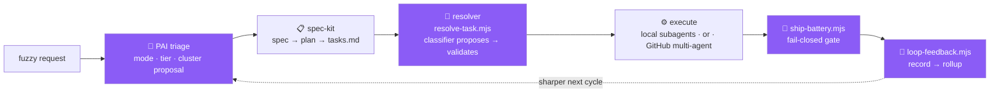

<!-- readme-gen:start:hero -->
<div align="center">


</div>

<div align="center">

[](LICENSE)
[](#cluster-catalog)
[](skill-index.json)
[](#context-debloat--active--deferred-tiers)
[](https://skills.sh/)
[](https://github.com/Sheshiyer/skill-clusters/stargazers)

</div>
<!-- readme-gen:end:hero -->

<div align="center">

**716 agent skills, organized into 40 hub-and-spoke _clusters_, wired into a closed delivery loop.**
A fuzzy request — _"ship this Tauri app", "make a promo video", "run the next GitHub wave"_ — is
**triaged → resolved to the right cluster → executed → gated → and fed back**, while only **54 router
skills** ever touch a CLI's startup context.

</div>


## The big idea — a closed loop, not a skill dump

Most "awesome-skills" repos are a **flat pile**: hundreds of skills an agent must already know how to
reach for, all charged to startup context. Skill-clusters is the opposite — a **capability engine** with
four moving parts that close a loop:



| Organ | Owns | In this repo |
|---|---|---|
| **PAI** triage + gates | _when / how much / enforce_ | hooks (`SkillClusterResolver`), fail-closed batteries |
| **spec-kit** | the spec — structure of _what_ | `tasks.md` = the machine-parseable queue |
| **conducty** | the loop — orchestrate + close | the `conductor` cluster (19 vendored loop skills) |
| **skill-clusters** ⭐ | _which capability runs each task_ | `skill-index.json` + `resolve-task.mjs` + 40 hub orchestrators |

The fourth organ — **the resolver** — is the one none of the other three has. It turns a task with no
skill binding into a validated `<cluster>-orchestrator` dispatch, phantom-proof against the index. Full
contract in **[`docs/CONDUCTOR-INTEGRATION.md`](docs/CONDUCTOR-INTEGRATION.md)**.


## How a cluster works

Individual skills are powerful but **flat** — an agent has to already know *which* of 716 skills to reach
for. A **cluster** adds the missing layer:

1. **`<name>-orchestrator`** — an intent **router**: classifies a fuzzy request and points at the right spoke.
2. **`<name>-core`** — a shared **reference**: decision rules, conventions, version matrix, guardrails — so spokes never duplicate or contradict.
3. **spokes** — the stack's actual skills (referenced canonically), plus any authored to fill gaps. They load **on demand**.

Only the orchestrator + core are enumerated at startup; spokes are pulled in by `Read` when the router
needs them. Pattern proven by [`explee-skills`](https://github.com/Sheshiyer/explee-skills); the flat
`/skills/` layout follows [`vercel-labs/agent-skills`](https://github.com/vercel-labs/agent-skills).


## Cluster catalog

<!-- readme-gen:start:catalog -->
**40 clusters · 716 indexed skills.** Each links to its own full page. `source` = how it was created:
`extract` (re-clustered from ECC), `author` (written here), `curate` (community skills, vetted),
`vendor` (a whole loop adopted, MIT).

### ⭐ Flagship — authored hub-and-spoke pilots

| Cluster | Domain | Spokes | Source |
|---|---|--:|---|
| [**tauri**](clusters/tauri) | Cross-platform desktop/mobile (Rust + web) — the flagship | 40 | author |
| [**creative-frontend**](clusters/creative-frontend) | Astro · GSAP · Remotion — web motion + programmatic video | 7 | author |
| [**expo**](clusters/expo) | Expo toolchain — EAS, dev client, Expo Router, modules | 9 | author |
| [**react-native**](clusters/react-native) | RN UI, animation, touch, data (toolchain-agnostic) | 4 | author |
| [**astro**](clusters/astro) | Static-first sites: islands, content, SSR, publishing | 2 | author |
| [**raycast**](clusters/raycast) | Extensions, AI tools, Store publishing | 2 | author + curate |
| [**electron**](clusters/electron) | Main/renderer, IPC, security, packaging, updates | 6 | author |

### 🔁 The loop

| Cluster | Domain | Spokes | Source |
|---|---|--:|---|
| [**conductor**](clusters/conductor) | The closed conductor loop — shape→plan→execute→verify→ship | 19 | vendor ([conducty](https://github.com/robertbarclayy/conducty)) |

### 🧩 Extracted from ECC (21 · MIT)

Re-clustered from [affaan-m/ECC](https://github.com/affaan-m/ECC)'s 251 flat skills into hub-and-spoke form:

[`ai-agents-meta`](clusters/ai-agents-meta) · [`quality-eval`](clusters/quality-eval) · [`frontend-web`](clusters/frontend-web) · [`python-backend`](clusters/python-backend) · [`backend-architecture`](clusters/backend-architecture) · [`databases-data`](clusters/databases-data) · [`devops-infra`](clusters/devops-infra) · [`security`](clusters/security) · [`research-knowledge`](clusters/research-knowledge) · [`agentic-ops`](clusters/agentic-ops) · [`rust`](clusters/rust) · [`native-ios`](clusters/native-ios) · [`jvm`](clusters/jvm) · [`php-laravel`](clusters/php-laravel) · [`systems-languages`](clusters/systems-languages) · [`mobile-flutter`](clusters/mobile-flutter) · [`healthcare`](clusters/healthcare) · [`blockchain-web3`](clusters/blockchain-web3) · [`business-content`](clusters/business-content) · [`social-media`](clusters/social-media) · [`supply-chain`](clusters/supply-chain)

### 🌱 Curated & newer (platforms · growth · delivery)

| Cluster | Domain | Spokes | Source |
|---|---|--:|---|
| [**cloudflare**](clusters/cloudflare) | Workers, Pages, KV/R2/D1, edge | — | author + curate |
| [**supabase**](clusters/supabase) | Postgres, auth, RLS, edge functions | — | author + curate |
| [**design**](clusters/design) | UI/UX, design systems, a11y | — | curate |
| [**growth-seo**](clusters/growth-seo) | Technical + content SEO | — | curate |
| [**growth-content**](clusters/growth-content) | Content engines, editorial | — | curate |
| [**git-pr-ops**](clusters/git-pr-ops) | Issues, PRs, reviews, **GitHub next-wave delivery** | — | author + curate |
| [**browser-automation**](clusters/browser-automation) | Playwright/headless flows | — | curate |
| [**media-gen**](clusters/media-gen) | Image/video/audio generation (fal.ai, HF) | — | curate |
| [**documents**](clusters/documents) | PDF/doc pipelines | — | curate |
| [**extra-languages**](clusters/extra-languages) | Long-tail language skills | — | extract + curate |
| [**growth-sales-cro**](clusters/growth-sales-cro) | Sales, CRO, funnels | — | author |

*Deferred clusters (off by default): `php-laravel · jvm · systems-languages · mobile-flutter · healthcare · supply-chain · blockchain-web3 · business-content · social-media · extra-languages · media-gen · documents · growth-sales-cro`. Activate any with `node scripts/tier.mjs --activate <cluster> --apply`.*
<!-- readme-gen:end:catalog -->


## Two execution modalities

The loop runs in one of two ways — the conductor proposes, `resolve-task --modality` validates. The
per-task **cluster** (capability) is identical across both; modality decides **who** runs each task.

| | **local** | **github-delivery** |
|---|---|---|
| Plan | conducty-plan | [`swarm-architect`](https://github.com/Sheshiyer/swarm-architect-skill) — phase→wave→swarm, ~80 tasks |
| Execute | conducty-execute → loaded subagents | [`github-next-wave-orchestrator`](https://github.com/Sheshiyer/github-next-wave-orchestrator) — 👤 human / 🤖 `copilot-swe-agent[bot]` lanes |
| Gate | `ship-battery.mjs` | swarm gates + `ship-battery.mjs` |
| Close | `loop-feedback.mjs` | OpenViking memory + `loop-feedback.mjs` |

## Context debloat — active / deferred tiers

<!-- readme-gen:start:debloat -->
Skills cost context — every skill a CLI scans at startup spends name+description tokens in *every*
session. Clusters are a **debloat** mechanism: the CLI loads one **orchestrator** (+ core) per *active*
cluster — the index — and spokes load **on demand**.

[`profiles.json`](profiles.json) defines two tiers; [`scripts/tier.mjs`](scripts/tier.mjs) deploys them:

| Tier | Startup cost | Count |
|---|---|--:|
| **active** | orchestrator + core only → **54 enumerated hubs** | 27 clusters |
| **deferred** | **0** until activated | 13 clusters |

**Result: 716 indexed → 54 enumerated at startup (−92%).** Spokes aren't registered as skills; an
orchestrator routes to one and the agent `Read`s it on demand from
`~/.agents/skill-clusters/skills/<name>/SKILL.md` (a non-scanned pointer the deployer creates).

```bash
npm run tier                                            # list tiers + what's deployed
npm run tier:apply                                      # deploy active hub+core (default)
node scripts/tier.mjs --activate php-laravel --apply    # debugging an old PHP project? pull it in
node scripts/tier.mjs --deactivate php-laravel --apply  # put it back to sleep
```
<!-- readme-gen:end:debloat -->

## The tooling

<!-- readme-gen:start:tooling -->
Zero-dependency Node (`.mjs`) — the machinery that makes the loop real:

| Script | Role |
|---|---|
| [`resolve-task.mjs`](scripts/resolve-task.mjs) | **the resolver** — task → cluster + lane; classifier proposes, it validates (phantom-proof) |
| [`ship-battery.mjs`](scripts/ship-battery.mjs) | **fail-closed gate** — structural · secrets · lint · typecheck · tests; non-zero exit blocks ship |
| [`loop-feedback.mjs`](scripts/loop-feedback.mjs) | **the close** — record each cycle → rollup the signal the next plan reads |
| [`skills-health.mjs`](scripts/skills-health.mjs) | structural gate — name==dir, manifest reconcile, no orphans, dead-symlink check |
| [`tier.mjs`](scripts/tier.mjs) | tier + hub deployer — active orchestrators+cores only; spokes on demand |
| [`gen-index.mjs`](scripts/gen-index.mjs) | generates `skill-index.json` (the resolution map) |
| [`archive-library.mjs`](scripts/archive-library.mjs) | moves non-cluster skills to the archive (reversible) |
| [`audit-refs.mjs`](scripts/audit-refs.mjs) · [`skills-normalize.mjs`](scripts/skills-normalize.mjs) · [`integrate-ecc.mjs`](scripts/integrate-ecc.mjs) | reference audit · frontmatter backfill · ECC importer |
<!-- readme-gen:end:tooling -->

## Single source of truth

These files are canonical **here**. Your local runtime (`~/.agents/skills`) points back at them via
symlink, so there's exactly one copy and no drift:

```bash
./scripts/link-agents.sh            # preview (safe)
./scripts/link-agents.sh --apply    # symlink (originals backed up to ~/.agents/skills.backup)
./scripts/link-agents.sh --unlink --apply   # restore
```

## Install (skills.sh)

```bash
npx skills add Sheshiyer/skill-clusters@creative-frontend-orchestrator -g -y
```

## Repository layout

```
📦 skill-clusters
├── 📄 skills.sh.json            # manifest — each "grouping" IS a cluster (skills.sh)
├── 📄 skill-index.json          # the resolution map: skill → cluster · tier · role · status
├── 📄 profiles.json             # active / deferred tiers
├── 📂 skills/                   # FLAT (what `npx skills` resolves) — orchestrators, cores, spokes
├── 📂 clusters/<name>/README.md # per-cluster docs: banner, mermaid, skills table, install
├── 📂 scripts/                  # the loop machinery (resolve-task, ship-battery, loop-feedback, tier…)
├── 📂 docs/                     # CONDUCTOR-INTEGRATION · ROADMAP · ECC-EXTRACTION-PLAN · HARNESS-HANDOFF
├── 📂 feedback/                 # loop-log.jsonl (git-ignored) + the close contract
└── 📄 NOTICE                    # contribution attribution (MIT upstreams)
```


## Acknowledgements & contributions

This project's added contribution is the **clustering, the resolver, the gates, and the closed-loop
integration**. The spoke content stands on the shoulders of these open-source projects (all MIT — see
**[`NOTICE`](NOTICE)**):

| Upstream | What we use | License |
|---|---|---|
| [affaan-m/ECC](https://github.com/affaan-m/ECC) | 21 clusters re-extracted from 251 flat skills | MIT |
| [robertbarclayy/conducty](https://github.com/robertbarclayy/conducty) | the 19-skill conductor loop (the `conductor` cluster) | MIT |
| [sickn33/antigravity-awesome-skills](https://github.com/sickn33/antigravity-awesome-skills) | curated spokes (fal.ai, HuggingFace, Dimillian, claude-seo, scientific-Python) | MIT |
| [Sheshiyer/explee-skills](https://github.com/Sheshiyer/explee-skills) | the hub-and-spoke pattern origin | — |
| [vercel-labs/agent-skills](https://github.com/vercel-labs/agent-skills) | the flat `/skills/` + manifest convention | — |
| [Sheshiyer/swarm-architect-skill](https://github.com/Sheshiyer/swarm-architect-skill) · [github-next-wave-orchestrator](https://github.com/Sheshiyer/github-next-wave-orchestrator) | the GitHub multi-agent delivery modality | MIT |

Each picked-up skill records its provenance in `origin:` frontmatter.

## License

[MIT](LICENSE) © 2026 Sheshnarayan Iyer

<!-- readme-gen:start:footer -->
<div align="center">


**Built with ❤️ — one cluster per stack, one loop to run them.**
[Contributors](https://github.com/Sheshiyer/skill-clusters/graphs/contributors) · [Conductor integration](docs/CONDUCTOR-INTEGRATION.md) · [Roadmap](docs/ROADMAP.md)

</div>
<!-- readme-gen:end:footer -->
