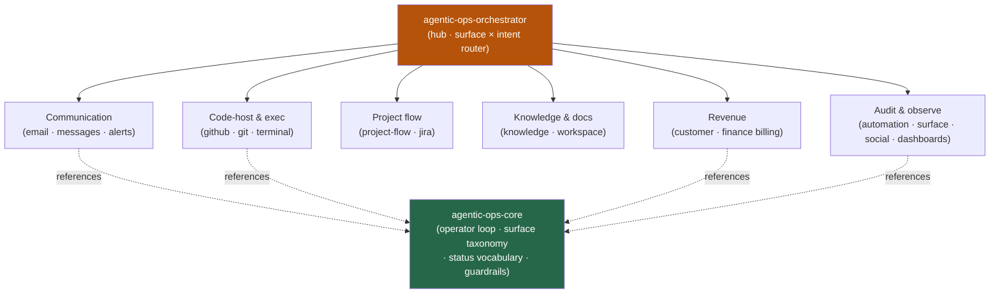

<div align="center">


</div>

<div align="center">

[](../../LICENSE)
[](../../skills.sh.json)
[](../../skills/agentic-ops-core/SKILL.md)
[](https://skills.sh/)

**Real-world operations for autonomous agents — 16 surface specialists behind a single router.**
Operating an inbox, a repo, a tracker, a billing system, or a docs drive? The orchestrator places
your task on the **surface × intent** map and routes; `agentic-ops-core` holds the evidence-first
operator loop they all run.

</div>


## What it is

18 skills: `agentic-ops-orchestrator` (router) + `agentic-ops-core` (shared model) + 16 operator
specialists. The cluster's job is to make an agent's real-world actions **provable** — the
orchestrator knows which surface to reach for, and the core keeps the one loop every spoke shares
(resolve surface → read live state → smallest reversible action → prove it → report an exact status
word) consistent, so nothing is claimed that wasn't verified.



## Skills by surface

| Surface | Spokes |
|---|---|
| **Router / model** | `agentic-ops-orchestrator`, `agentic-ops-core` |
| **Communication** | `email-ops`, `messages-ops`, `unified-notifications-ops` |
| **Code-host & execution** | `github-ops`, `git-workflow`, `terminal-ops` |
| **Project flow & trackers** | `project-flow-ops`, `jira-integration` |
| **Knowledge & documents** | `knowledge-ops`, `google-workspace-ops` |
| **Revenue** | `customer-billing-ops`, `finance-billing-ops` |
| **Audit & observability** | `automation-audit-ops`, `workspace-surface-audit`, `connections-optimizer`, `dashboard-builder` |

## The model that ties it together

Every spoke runs the same **evidence-first operator loop**:

```
Resolve surface ──> Read live state ──> Smallest reversible action ──> Prove it ──> Report exact status
```

Read before you write; default to draft / read-only / no-op unless a live action was explicitly
requested; never claim *sent / pushed / fixed / refunded* without naming the proof. Full model —
the surface taxonomy, the status-word contract, the freshness and no-duplicate rules, and the
shared guardrails — in [`agentic-ops-core`](../../skills/agentic-ops-core/SKILL.md).

## Install

```bash
npx skills add Sheshiyer/skill-clusters@agentic-ops-orchestrator -g -y     # entry point
npx skills add Sheshiyer/skill-clusters@terminal-ops -g -y                 # any spoke
```

## Local development

Part of the [`skill-clusters`](../../README.md) monorepo; the repo is the single source of truth.

```bash
./scripts/link-agents.sh --apply    # symlink ~/.agents/skills → these canonical copies
```
