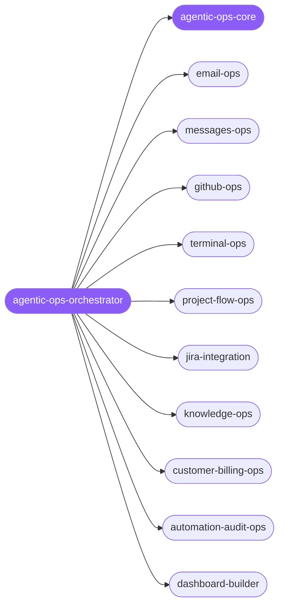

<div align="center">

</div>

<div align="center">

[](../../profiles.json)
[](#skills)
[](../../NOTICE)
[](https://skills.sh/)

</div>

> The single entry point for **operating real-world surfaces** as an autonomous agent — inbox, repo, issue tracker, billing system, docs drive, alert stream. It locates the task on the surface × intent map and delegates to one of 26 operator spokes, each running the shared **evidence-first operator loop** (resolve the surface → read live state → smallest reversible action → prove it → report exact status) with the secrets/PII guardrails defined in `agentic-ops-core`.

## Hub-and-spoke



_…and 16 more in the table below._

## Skills

| Skill | Role | Loaded at startup |
|---|---|---|
| `agentic-ops-orchestrator` | 🧭 hub · router | ✅ enumerated |
| `agentic-ops-core` | 📐 hub · shared reference | ✅ enumerated |
| `email-ops` | spoke | ⤵ on-demand |
| `messages-ops` | spoke | ⤵ on-demand |
| `github-ops` | spoke | ⤵ on-demand |
| `jira-integration` | spoke | ⤵ on-demand |
| `google-workspace-ops` | spoke | ⤵ on-demand |
| `project-flow-ops` | spoke | ⤵ on-demand |
| `unified-notifications-ops` | spoke | ⤵ on-demand |
| `terminal-ops` | spoke | ⤵ on-demand |
| `knowledge-ops` | spoke | ⤵ on-demand |
| `customer-billing-ops` | spoke | ⤵ on-demand |
| `finance-billing-ops` | spoke | ⤵ on-demand |
| `automation-audit-ops` | spoke | ⤵ on-demand |
| `workspace-surface-audit` | spoke | ⤵ on-demand |
| `connections-optimizer` | spoke | ⤵ on-demand |
| `dashboard-builder` | spoke | ⤵ on-demand |
| `git-workflow` | spoke | ⤵ on-demand |
| `connect` | spoke | ⤵ on-demand |
| `connect-apps` | spoke | ⤵ on-demand |
| `langsmith-fetch` | spoke | ⤵ on-demand |
| `supacode-cli` | spoke | ⤵ on-demand |
| `hyperframes-cli` | spoke | ⤵ on-demand |
| `developer-growth-analysis` | spoke | ⤵ on-demand |
| `ai-automation-workflows` | spoke | ⤵ on-demand |
| `coding-agent` | spoke | ⤵ on-demand |
| `model-usage` | spoke | ⤵ on-demand |
| `gemini` | spoke | ⤵ on-demand |

## Tier & loading

Enumerated at CLI startup (orchestrator + core); spokes load on demand from `~/.agents/skill-clusters/skills/<name>/SKILL.md`.

## Install

```bash
npx skills add Sheshiyer/skill-clusters@agentic-ops-orchestrator -g -y
```

## Attribution

Primary source: **ECC** (`affaan-m/ECC`, MIT). See [../../NOTICE](../../NOTICE).

---
<sub>Part of <a href="../../README.md">skill-clusters</a> — the conductor closed-loop system · <a href="../../docs/CONDUCTOR-INTEGRATION.md">how it's wired</a></sub>
