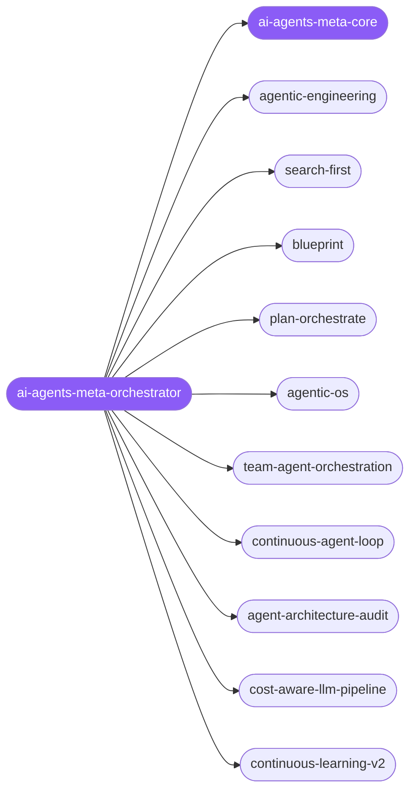

<div align="center">

</div>

<div align="center">

[](../../profiles.json)
[](#skills)
[](../../NOTICE)
[](https://skills.sh/)

</div>

> The meta layer above any one agent app — *building agents that build*. It locates a task on the lifecycle × concern map (plan → compose → orchestrate → loop → audit → economize → evolve) and routes to a specialist, with one cross-cutting decision every spoke turns on: **eval-first execution behind a default-deny autonomy boundary**.

## Hub-and-spoke



_…and 43 more in the table below._

## Skills

| Skill | Role | Loaded at startup |
|---|---|---|
| `ai-agents-meta-orchestrator` | 🧭 hub · router | ✅ enumerated |
| `ai-agents-meta-core` | 📐 hub · shared reference | ✅ enumerated |
| `agentic-engineering` | spoke | ⤵ on-demand |
| `agentic-os` | spoke | ⤵ on-demand |
| `agent-architecture-audit` | spoke | ⤵ on-demand |
| `agent-introspection-debugging` | spoke | ⤵ on-demand |
| `prompt-optimizer` | spoke | ⤵ on-demand |
| `token-budget-advisor` | spoke | ⤵ on-demand |
| `cost-aware-llm-pipeline` | spoke | ⤵ on-demand |
| `team-agent-orchestration` | spoke | ⤵ on-demand |
| `continuous-agent-loop` | spoke | ⤵ on-demand |
| `dynamic-workflow-mode` | spoke | ⤵ on-demand |
| `blueprint` | spoke | ⤵ on-demand |
| `search-first` | spoke | ⤵ on-demand |
| `plan-orchestrate` | spoke | ⤵ on-demand |
| `continuous-learning-v2` | spoke | ⤵ on-demand |
| `swarm-architect` | spoke | ⤵ on-demand |
| `task-master-planner` | spoke | ⤵ on-demand |
| `arch-orchestrator` | spoke | ⤵ on-demand |
| `accesslint-audit` | spoke | ⤵ on-demand |
| `agent-evaluation` | spoke | ⤵ on-demand |
| `agent-memory-systems` | spoke | ⤵ on-demand |
| `agent-tool-builder` | spoke | ⤵ on-demand |
| `bullmq-specialist` | spoke | ⤵ on-demand |
| `context-window-management` | spoke | ⤵ on-demand |
| `conversation-memory` | spoke | ⤵ on-demand |
| `convex` | spoke | ⤵ on-demand |
| …and 28 more | spoke | ⤵ on-demand |

## Tier & loading

Enumerated at CLI startup (orchestrator + core); spokes load on demand from `~/.agents/skill-clusters/skills/<name>/SKILL.md`.

## Install

```bash
npx skills add Sheshiyer/skill-clusters@ai-agents-meta-orchestrator -g -y
```

## Attribution

Primary source: **antigravity-awesome-skills** (MIT) + mixed (ECC and skills authored for skill-clusters). See [NOTICE](../../NOTICE).

---
<sub>Part of <a href="../../README.md">skill-clusters</a> — the conductor closed-loop system · <a href="../../docs/CONDUCTOR-INTEGRATION.md">how it's wired</a></sub>
