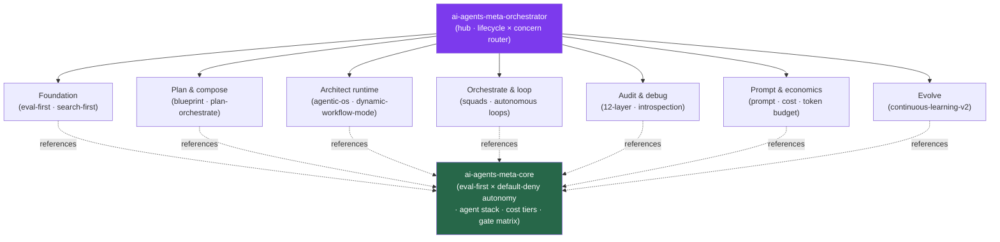

<div align="center">


</div>

<div align="center">

[](../../LICENSE)
[](../../skills.sh.json)
[](../../skills/ai-agents-meta-core/SKILL.md)
[](https://skills.sh/)

**The meta cluster — 14 agent-engineering specialists behind a single router.**
Planning, orchestrating, looping, auditing, debugging, or economizing an LLM-agent system? The
orchestrator places your task on the **lifecycle × concern** map and routes;
`ai-agents-meta-core` holds the eval-first, default-deny-autonomy model they all share.

</div>


## What it is

16 skills: `ai-agents-meta-orchestrator` (router) + `ai-agents-meta-core` (shared model) + 14
specialists for building agents that build. The cluster's job is to make the *meta* layer —
how you design, run, and harden an agent system — navigable: the orchestrator knows which
specialist to reach for, and the core keeps the interlocking ideas (eval gates, autonomy
budgets, the agent stack, cost-routing tiers) consistent across all of them.



## Skills by concern

| Concern | Spokes |
|---|---|
| **Router / model** | `ai-agents-meta-orchestrator`, `ai-agents-meta-core` |
| **Foundation & discipline** | `agentic-engineering`, `search-first` |
| **Plan & compose** | `blueprint`, `plan-orchestrate` |
| **Architect the runtime** | `agentic-os`, `dynamic-workflow-mode` |
| **Orchestrate & loop** | `team-agent-orchestration`, `continuous-agent-loop` |
| **Audit & debug** | `agent-architecture-audit`, `agent-introspection-debugging` |
| **Prompt & economics** | `prompt-optimizer`, `cost-aware-llm-pipeline`, `token-budget-advisor` |
| **Evolve** | `continuous-learning-v2` |

## The model that ties it together

Every spoke answers one question — *how much can this agent do on its own, and how do we know
it did it right?* The cluster's stance couples two rules:

```
Plan ──gated by──> Eval ──authorizes──> Autonomous step ──bounded by──> Tool / loop budget
```

**Eval-first**: no unattended step ships without a gate that can fail it. **Default-deny
autonomy**: grant the narrowest tool/permission/loop budget that works, and state every
widening. Full model in [`ai-agents-meta-core`](../../skills/ai-agents-meta-core/SKILL.md).

## Install

```bash
npx skills add Sheshiyer/skill-clusters@ai-agents-meta-orchestrator -g -y   # entry point
npx skills add Sheshiyer/skill-clusters@agent-architecture-audit -g -y      # any spoke
```

## Local development

Part of the [`skill-clusters`](../../README.md) monorepo; the repo is the single source of truth.

```bash
./scripts/link-agents.sh --apply    # symlink ~/.agents/skills → these canonical copies
```
