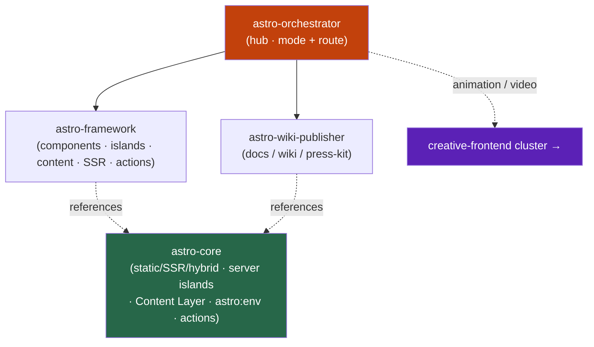

<div align="center">


</div>

<div align="center">

[](../../LICENSE)
[](../../skills.sh.json)
[](https://astro.build)
[](https://skills.sh/)

**Hub-and-spoke cluster for Astro — the framework, not the animation layer.**
The orchestrator picks the rendering strategy and routes; `astro-core` holds the static/SSR/hybrid
decision, content model, and hydration rules. For motion on an Astro page, see **[creative-frontend](../creative-frontend)**.

</div>


## What it is

`astro-orchestrator` + `astro-core` + the deep `astro-framework` (shared with creative-frontend)
+ `astro-wiki-publisher`. The cluster's value is the **rendering-mode decision** and content
strategy up front, then delegating implementation to the comprehensive framework skill.



## Skills

| Skill | Role |
|---|---|
| `astro-orchestrator` | Router — rendering mode → spoke |
| `astro-core` | Static/SSR/hybrid decision, Content Layer, hydration, `astro:env`/actions, adapters |
| `astro-framework` | *(shared)* deep implementation: islands, content, SSR, actions, i18n, view transitions |
| `astro-wiki-publisher` | Publish/harden docs/wiki/press-kit sites |

## The decision that routes everything

| Content | Mode |
|---|---|
| Known at build time | **Static (SSG)** — default |
| Per-request (auth, personalization) | **On-demand SSR** (`prerender = false`) |
| Static page, a few dynamic fragments | **Server islands** (`server:defer`) |

Ship static by default; full model in [`astro-core`](../../skills/astro-core/SKILL.md).

## Install

```bash
npx skills add Sheshiyer/skill-clusters@astro-orchestrator -g -y
```

## Local development

Part of the [`skill-clusters`](../../README.md) monorepo (repo = single source of truth):

```bash
./scripts/link-agents.sh --apply
```
