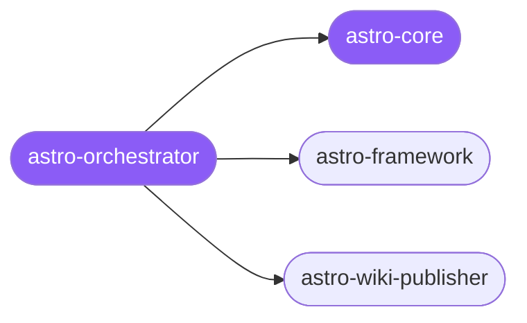

<div align="center">

</div>

<div align="center">

[](../../profiles.json)
[](#skills)
[](../../NOTICE)
[](https://skills.sh/)

</div>

> Entry point for **Astro** site work — the framework itself, not the animation layer. The orchestrator picks the rendering strategy (static vs on-demand SSR vs hybrid + server islands) and routes to the right spoke, while `astro-core` holds the shared rendering-mode decision, hydration directives, Content Layer model, `astro:env`/sessions/actions conventions, and SSR adapter selection.

## Hub-and-spoke



## Skills

| Skill | Role | Loaded at startup |
|---|---|---|
| `astro-orchestrator` | 🧭 hub · router | ✅ enumerated |
| `astro-core` | 📐 hub · shared reference | ✅ enumerated |
| `astro-framework` | spoke | ⤵ on-demand |
| `astro-wiki-publisher` | spoke | ⤵ on-demand |

## Tier & loading

Enumerated at CLI startup (orchestrator + core); spokes load on demand from `~/.agents/skill-clusters/skills/<name>/SKILL.md`.

## Install

```bash
npx skills add Sheshiyer/skill-clusters@astro-orchestrator -g -y
```

## Attribution

Authored for skill-clusters (MIT). + mixed — `astro-framework` is a community Astro skill (author: delineas) vendored under MIT. See [NOTICE](../../NOTICE).

---
<sub>Part of <a href="../../README.md">skill-clusters</a> — the conductor closed-loop system · <a href="../../docs/CONDUCTOR-INTEGRATION.md">how it's wired</a></sub>
