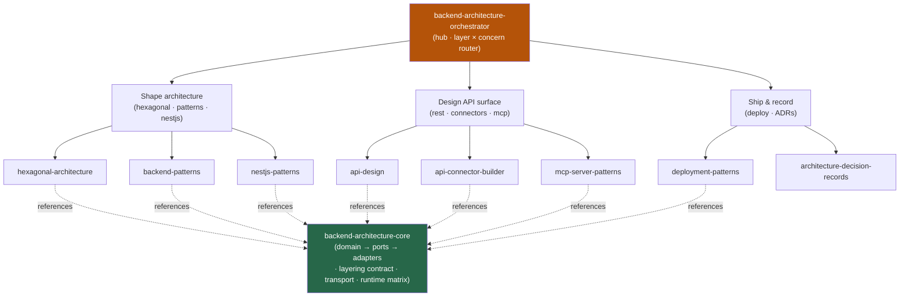

<div align="center">


</div>

<div align="center">

[](../../LICENSE)
[](../../skills.sh.json)
[](../../skills/backend-architecture-orchestrator/SKILL.md)
[](https://skills.sh/)

**8 server-side specialists behind a single router.**
Designing, building, integrating, or shipping a backend? The orchestrator places your task on the
**layer × concern** map and routes; `backend-architecture-core` holds the dependency-inversion
boundary they all share.

</div>


## What it is

10 skills: `backend-architecture-orchestrator` (router) + `backend-architecture-core`
(shared model) + 8 specialists. The cluster's job is to keep a backend's business logic
independent of frameworks and I/O — the orchestrator knows which specialist to reach for, and
the core keeps the interlocking layering rules (domain → ports → adapters, transport conventions,
runtime matrix) consistent.



## Skills by concern

| Concern | Spokes |
|---|---|
| **Router / model** | `backend-architecture-orchestrator`, `backend-architecture-core` |
| **Shape architecture** | `hexagonal-architecture`, `backend-patterns`, `nestjs-patterns` |
| **Design API surface** | `api-design`, `api-connector-builder`, `mcp-server-patterns` |
| **Ship & record** | `deployment-patterns`, `architecture-decision-records` |

## The model that ties it together

**Dependencies point inward** — the domain never imports a framework, driver, or HTTP client:

```
HTTP · CLI · queue ──> [Port] ──> Domain + Use cases ──> [Port] ──> DB · API · bus · cache
   inbound adapters                (no framework imports)            outbound adapters
```

Put a port between business logic and anything swappable; validate at the transport boundary;
match the repo's existing pattern instead of inventing a second architecture. Full model in
[`backend-architecture-core`](../../skills/backend-architecture-core/SKILL.md).

## Install

```bash
npx skills add Sheshiyer/skill-clusters@backend-architecture-orchestrator -g -y   # entry point
npx skills add Sheshiyer/skill-clusters@hexagonal-architecture -g -y              # any spoke
```

## Local development

Part of the [`skill-clusters`](../../README.md) monorepo; the repo is the single source of truth.

```bash
./scripts/link-agents.sh --apply    # symlink ~/.agents/skills → these canonical copies
```
