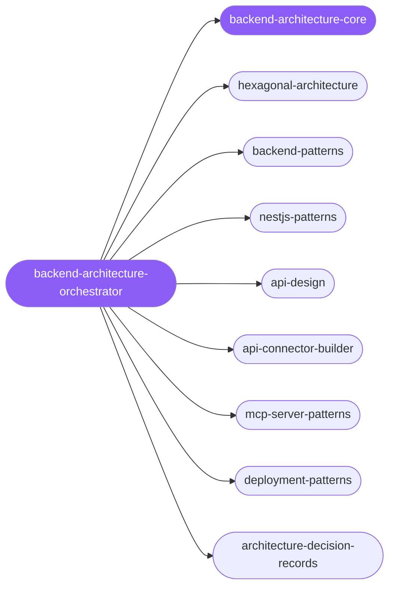

<div align="center">

</div>

<div align="center">

[](../../profiles.json)
[](#skills)
[](../../NOTICE)
[](https://skills.sh/)

</div>

> The single entry skill for server-side work: it locates a task on the **layer × concern** map and delegates to one of 8 specialist spokes — architecture boundaries (hexagonal/ports-and-adapters), REST API design, HTTP connector building, NestJS structure, MCP servers, deployment/CI-CD, and decision records. The cross-cutting model every backend shares — the dependency-inversion boundary (domain → ports → adapters), the layering contract, transport conventions, and the runtime matrix — lives in `backend-architecture-core`.

## Hub-and-spoke



## Skills

| Skill | Role | Loaded at startup |
|---|---|---|
| `backend-architecture-orchestrator` | 🧭 hub · router | ✅ enumerated |
| `backend-architecture-core` | 📐 hub · shared reference | ✅ enumerated |
| `hexagonal-architecture` | spoke | ⤵ on-demand |
| `backend-patterns` | spoke | ⤵ on-demand |
| `nestjs-patterns` | spoke | ⤵ on-demand |
| `api-design` | spoke | ⤵ on-demand |
| `api-connector-builder` | spoke | ⤵ on-demand |
| `mcp-server-patterns` | spoke | ⤵ on-demand |
| `deployment-patterns` | spoke | ⤵ on-demand |
| `architecture-decision-records` | spoke | ⤵ on-demand |

## Tier & loading

Enumerated at CLI startup (orchestrator + core); spokes load on demand from `~/.agents/skill-clusters/skills/<name>/SKILL.md`.

## Install

```bash
npx skills add Sheshiyer/skill-clusters@backend-architecture-orchestrator -g -y
```

## Attribution

Spokes adapted from [affaan-m/ECC](../../NOTICE) (MIT). See [NOTICE](../../NOTICE) for full provenance.

---
<sub>Part of <a href="../../README.md">skill-clusters</a> — the conductor closed-loop system · <a href="../../docs/CONDUCTOR-INTEGRATION.md">how it's wired</a></sub>
