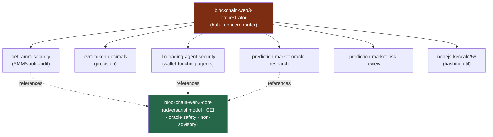

<div align="center">


</div>

<div align="center">

[](../../LICENSE)
[](../../skills.sh.json)
[](https://skills.sh/)

**Hub-and-spoke cluster for smart-contract / DeFi / on-chain work.**
The orchestrator routes by concern; `blockchain-web3-core` holds the one fact everything follows
from — **on-chain code is immutable, public, and adversarial.** Spokes extracted from
[affaan-m/ECC](https://github.com/affaan-m/ECC) (MIT, see [NOTICE](../../NOTICE)).

</div>


## What it is

A router + a shared adversarial-threat-model core + security/research spokes. Because a deployed
bug is permanent and exploitable for the contract's full value, the **security model is the spine**
— checks-effects-interactions, no spot-reserve oracles, explicit decimals, and a hard
**non-advisory** stance on the trading/prediction spokes.



## Skills

| Skill | Role |
|---|---|
| `blockchain-web3-orchestrator` | Router — concern → spoke |
| `blockchain-web3-core` | Adversarial model, CEI, oracle safety, decimals, non-advisory stance |
| `defi-amm-security` | AMM / vault / DeFi security review |
| `evm-token-decimals` | Token decimals & precision bugs |
| `llm-trading-agent-security` | Securing agents that hold a wallet / trade |
| `prediction-market-oracle-research` | Oracle design / manipulation research |
| `prediction-market-risk-review` | Prediction-market risk analysis |
| `nodejs-keccak256` | keccak256 hashing utility (match on-chain) |

## The fact everything turns on

On-chain code is **immutable, public, and adversarial** — anyone can call any function in any
order, all state is readable, transactions are front-runnable (MEV), and a bug is permanent.
Hence: checks-effects-interactions, reentrancy guards, TWAP/multi-source oracles, explicit
decimals, audited primitives, and **non-advisory** trading outputs that never auto-move funds.
Full model in [`blockchain-web3-core`](../../skills/blockchain-web3-core/SKILL.md).

## Install

```bash
npx skills add Sheshiyer/skill-clusters@blockchain-web3-orchestrator -g -y
```

## Local development

Part of the [`skill-clusters`](../../README.md) monorepo (repo = single source of truth):

```bash
./scripts/link-agents.sh --apply
```
