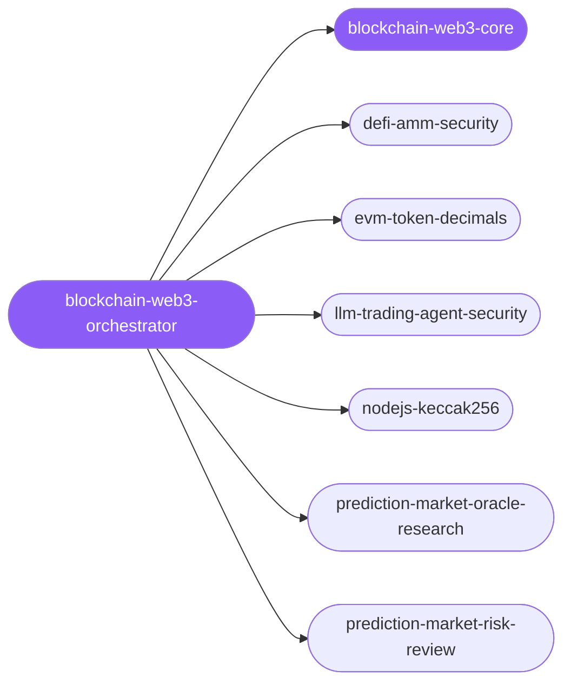

<div align="center">

</div>

<div align="center">

[](../../profiles.json)
[](#skills)
[](../../NOTICE)
[](https://skills.sh/)

</div>

> The single entry skill for EVM and prediction-market work. It places a task on the **surface × concern** map — what is touching value (a contract, an autonomous agent, a market signal) crossed with which failure mode (a silent correctness bug, an exploit, or an unreviewed risk) — and delegates to one of six specialist spokes that share one adversarial on-chain threat model and a non-advisory stance.

## Hub-and-spoke



## Skills

| Skill | Role | Loaded at startup |
|---|---|---|
| `blockchain-web3-orchestrator` | 🧭 hub · router | ✅ enumerated |
| `blockchain-web3-core` | 📐 hub · shared reference | ✅ enumerated |
| `defi-amm-security` | spoke | ⤵ on-demand |
| `evm-token-decimals` | spoke | ⤵ on-demand |
| `llm-trading-agent-security` | spoke | ⤵ on-demand |
| `nodejs-keccak256` | spoke | ⤵ on-demand |
| `prediction-market-oracle-research` | spoke | ⤵ on-demand |
| `prediction-market-risk-review` | spoke | ⤵ on-demand |

## Tier & loading

Off by default — 0 startup cost. Activate with `node scripts/tier.mjs --activate blockchain-web3 --apply`.

## Install

```bash
npx skills add Sheshiyer/skill-clusters@blockchain-web3-orchestrator -g -y
```

## Attribution

Authored for skill-clusters (MIT) — derived from [affaan-m/ECC](../../NOTICE) (MIT) + mixed. See [NOTICE](../../NOTICE).

---
<sub>Part of <a href="../../README.md">skill-clusters</a> — the conductor closed-loop system · <a href="../../docs/CONDUCTOR-INTEGRATION.md">how it's wired</a></sub>
