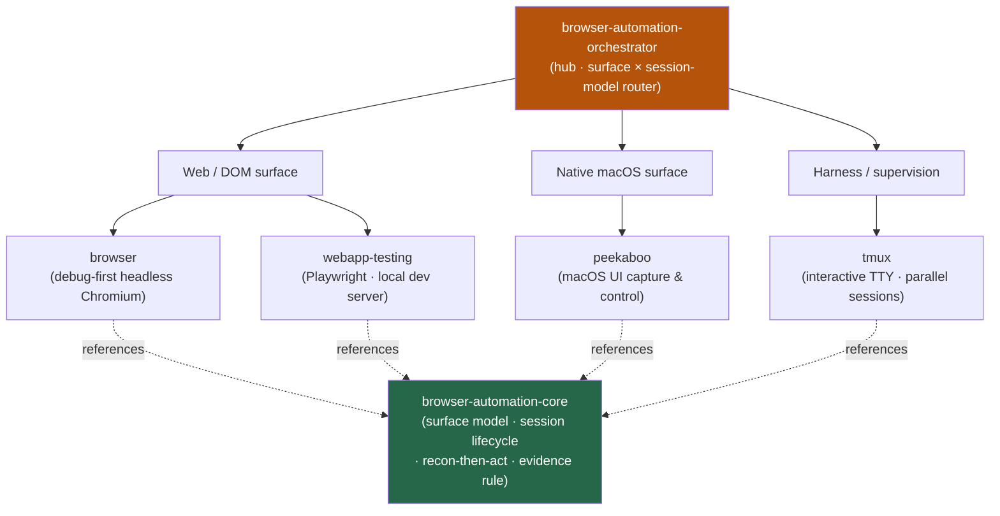

<div align="center">


</div>

<div align="center">

[](../../LICENSE)
[](../../skills.sh.json)
[](../../README.md)
[](https://skills.sh/)

**Drive any UI — web or native — behind a single router.**
Automating, scraping, screenshotting, or verifying a page or desktop app? The orchestrator places
your task on the **surface × session-model** map and routes; `browser-automation-core` holds the
shared model — the two surfaces, the session lifecycle, and the debug-first evidence rule.

</div>


## What it is

6 skills: `browser-automation-orchestrator` (router) + `browser-automation-core` (shared model) + 4
specialist drivers. The cluster's job is to make UI automation **navigable** — the orchestrator knows
whether your task lives on the **web/DOM** surface or the **native OS** surface, and which session
model fits, while the core keeps the interlocking conventions (recon-then-act, headless-by-default,
evidence-before-claims) consistent across every driver.



## Skills by surface

| Surface | Spokes |
|---|---|
| **Router / model** | `browser-automation-orchestrator`, `browser-automation-core` |
| **Web / DOM (Chromium)** | `browser`, `webapp-testing` |
| **Native macOS UI** | `peekaboo` |
| **Harness / supervision** | `tmux` |

## The model that ties it together

Start with one question — **what surface are you driving?**

```
target ──→  web page in a browser   → DOM selectors / ARIA refs → browser · webapp-testing
            native macOS app's UI    → OS accessibility elements → peekaboo
```

Then pick a session model (one-shot · persistent · server-backed · supervised-TTY), **recon before
you act** (snapshot the live state, discover real selectors), and **never claim "it works"** without
a seen screenshot plus a clean console/network read. Full model in
[`browser-automation-core`](../../skills/browser-automation-core/SKILL.md).

## Install

```bash
npx skills add Sheshiyer/skill-clusters@browser-automation-orchestrator -g -y   # entry point
npx skills add Sheshiyer/skill-clusters@browser -g -y                           # any spoke
```

## Local development

Part of the [`skill-clusters`](../../README.md) monorepo; the repo is the single source of truth.

```bash
./scripts/link-agents.sh --apply    # symlink ~/.agents/skills → these canonical copies
```
