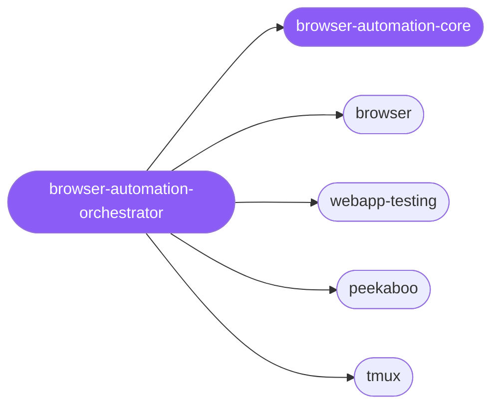

<div align="center">

</div>

<div align="center">

[](../../profiles.json)
[](#skills)
[](../../NOTICE)
[](https://skills.sh/)

</div>

> Routes a browser / UI automation task to the right driver by placing it on a **surface × session-model** map — the web/DOM layer vs the native macOS UI layer, one-shot vs persistent vs supervised-TTY. Spokes cover debug-first headless Chromium, local-webapp Playwright testing, native macOS UI capture and control, and an interactive-TTY harness that supervises them.

## Hub-and-spoke



## Skills

| Skill | Role | Loaded at startup |
|---|---|---|
| `browser-automation-orchestrator` | 🧭 hub · router | ✅ enumerated |
| `browser-automation-core` | 📐 hub · shared reference | ✅ enumerated |
| `browser` | spoke | ⤵ on-demand |
| `webapp-testing` | spoke | ⤵ on-demand |
| `peekaboo` | spoke | ⤵ on-demand |
| `tmux` | spoke | ⤵ on-demand |

## Tier & loading

Enumerated at CLI startup (orchestrator + core); spokes load on demand from `~/.agents/skill-clusters/skills/<name>/SKILL.md`.

## Install

```bash
npx skills add Sheshiyer/skill-clusters@browser-automation-orchestrator -g -y
```

## Attribution

Authored for skill-clusters (MIT). See [NOTICE](../../NOTICE).

---
<sub>Part of <a href="../../README.md">skill-clusters</a> — the conductor closed-loop system · <a href="../../docs/CONDUCTOR-INTEGRATION.md">how it's wired</a></sub>
