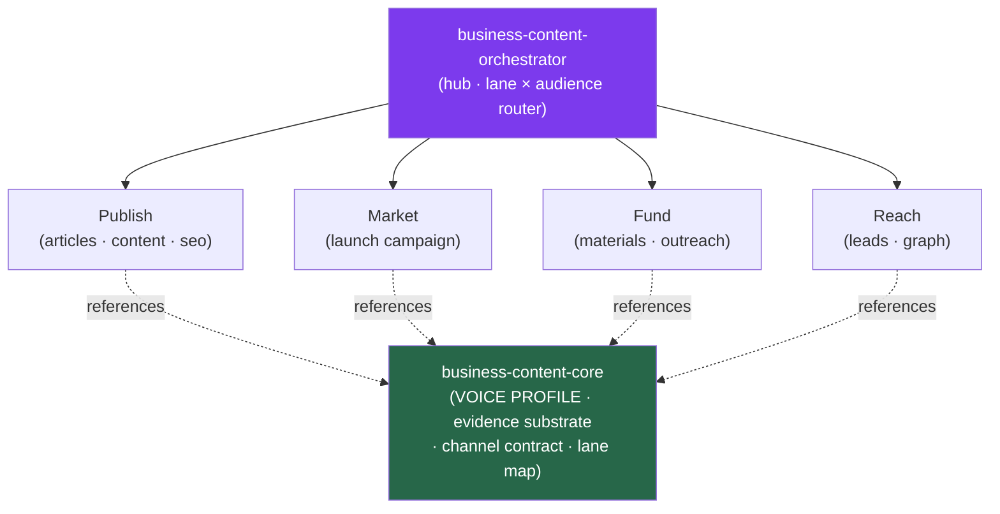

<div align="center">


</div>

<div align="center">

[](../../LICENSE)
[](../../skills.sh.json)
[](./README.md)
[](https://skills.sh/)

**Go-to-market writing and outbound — 10 specialists behind a single router.**
Writing, marketing, fundraising, or doing outbound for a product? The orchestrator places your
task on the **lane × audience** map and routes; `business-content-core` holds the Voice Profile
and evidence model they all share.

</div>


## What it is

12 skills: `business-content-orchestrator` (router) + `business-content-core` (shared model) +
10 specialists. The cluster's job is to keep go-to-market output *navigable and consistent* —
the orchestrator knows which lane to reach for, and the core keeps the interlocking conventions
(one source-derived Voice Profile, sourced evidence, channel-native messaging) consistent so the
writing never collapses into generic AI copy.



## Skills by lane

| Lane | Spokes |
|---|---|
| **Router / model** | `business-content-orchestrator`, `business-content-core` |
| **Substrate (shared)** | `brand-voice`, `market-research` |
| **Publish** | `article-writing`, `content-engine`, `seo` |
| **Market** | `marketing-campaign` |
| **Fund** | `investor-materials`, `investor-outreach` |
| **Reach** | `lead-intelligence`, `social-graph-ranker` |

## The model that ties it together

Every output is the same pipeline, whatever the lane:

```
Real sources ──> VOICE PROFILE ─┐
                                ├──> Draft ──> Channel-native output
Market facts ──> Evidence ──────┘
```

Build the Voice Profile once and reuse it everywhere; ground every business claim in a real
source; shape each message for its surface (the same copy across email, LinkedIn, and X is a
tell). Full model in [`business-content-core`](../../skills/business-content-core/SKILL.md).

## Install

```bash
npx skills add Sheshiyer/skill-clusters@business-content-orchestrator -g -y   # entry point
npx skills add Sheshiyer/skill-clusters@marketing-campaign -g -y              # any spoke
```

## Local development

Part of the [`skill-clusters`](../../README.md) monorepo; the repo is the single source of truth.

```bash
./scripts/link-agents.sh --apply    # symlink ~/.agents/skills → these canonical copies
```
