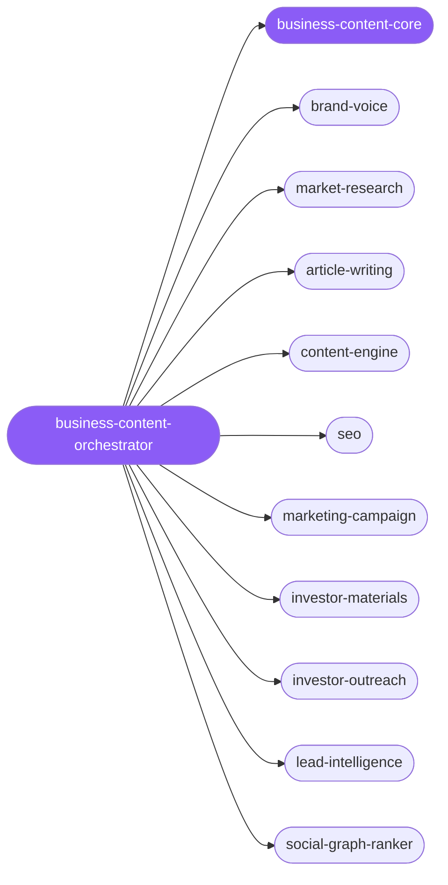

<div align="center">

</div>

<div align="center">

[](../../profiles.json)
[](#skills)
[](../../NOTICE)
[](https://skills.sh/)

</div>

> The single entry point for go-to-market writing and outbound: it locates a task on the **lane × audience** map — publish, market, fund, reach — and delegates to the right specialist. Every spoke shares one substrate: a source-derived **Voice Profile**, the market/competitor evidence base, and a per-channel message contract that keeps copy native to its surface and traceable to real sources.

## Hub-and-spoke



_…and 12 more in the table below._

## Skills

| Skill | Role | Loaded at startup |
| --- | --- | --- |
| `business-content-orchestrator` | 🧭 hub · router | ✅ enumerated |
| `business-content-core` | 📐 hub · shared reference | ✅ enumerated |
| `brand-voice` | spoke | ⤵ on-demand |
| `market-research` | spoke | ⤵ on-demand |
| `article-writing` | spoke | ⤵ on-demand |
| `content-engine` | spoke | ⤵ on-demand |
| `seo` | spoke | ⤵ on-demand |
| `marketing-campaign` | spoke | ⤵ on-demand |
| `investor-materials` | spoke | ⤵ on-demand |
| `investor-outreach` | spoke | ⤵ on-demand |
| `lead-intelligence` | spoke | ⤵ on-demand |
| `social-graph-ranker` | spoke | ⤵ on-demand |
| `aphorisms` | spoke | ⤵ on-demand |
| `writestory` | spoke | ⤵ on-demand |
| `inkos-multi-agent-novel-writing` | spoke | ⤵ on-demand |
| `novel-writer-workflow-guide` | spoke | ⤵ on-demand |
| `natural-dialogue-techniques` | spoke | ⤵ on-demand |
| `internal-comms` | spoke | ⤵ on-demand |
| `ai-product` | spoke | ⤵ on-demand |
| `ai-wrapper-product` | spoke | ⤵ on-demand |
| `micro-saas-launcher` | spoke | ⤵ on-demand |
| `notion-template-business` | spoke | ⤵ on-demand |
| `product-manager` | spoke | ⤵ on-demand |
| `segment-cdp` | spoke | ⤵ on-demand |

## Tier & loading

Off by default — 0 startup cost. Activate with `node scripts/tier.mjs --activate business-content --apply`.

## Install

```bash
npx skills add Sheshiyer/skill-clusters@business-content-orchestrator -g -y
```

## Attribution

Authored for skill-clusters (MIT), + mixed: 6 spokes are adapted from antigravity-awesome-skills (MIT). See [NOTICE](../../NOTICE) for the full per-skill provenance.

---
<sub>Part of <a href="../../README.md">skill-clusters</a> — the conductor closed-loop system · <a href="../../docs/CONDUCTOR-INTEGRATION.md">how it's wired</a></sub>
