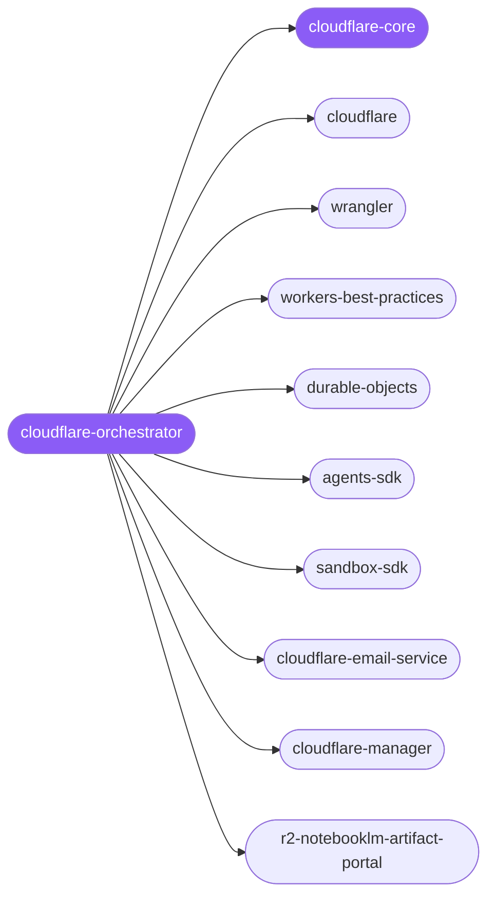

<div align="center">

</div>

<div align="center">

[](../../profiles.json)
[](#skills)
[](../../NOTICE)
[](https://skills.sh/)

</div>

> The single entry point for Cloudflare edge work: it locates a task on the **compute × primitive** map — Workers/Pages compute, the wrangler CLI and binding/config model, storage (KV, R2, D1), Durable Objects, the Agents and Sandbox SDKs, transactional email, and deploy/auth debugging — and delegates to the right specialist spoke. The cross-cutting model every Cloudflare app shares — compute reaching primitives **only through bindings** declared in `wrangler.jsonc` under a pinned `compatibility_date` — lives in `cloudflare-core`.

## Hub-and-spoke



## Skills

| Skill | Role | Loaded at startup |
|---|---|---|
| `cloudflare-orchestrator` | 🧭 hub · router | ✅ enumerated |
| `cloudflare-core` | 📐 hub · shared reference | ✅ enumerated |
| `cloudflare` | spoke | ⤵ on-demand |
| `wrangler` | spoke | ⤵ on-demand |
| `workers-best-practices` | spoke | ⤵ on-demand |
| `durable-objects` | spoke | ⤵ on-demand |
| `agents-sdk` | spoke | ⤵ on-demand |
| `sandbox-sdk` | spoke | ⤵ on-demand |
| `cloudflare-email-service` | spoke | ⤵ on-demand |
| `cloudflare-manager` | spoke | ⤵ on-demand |
| `r2-notebooklm-artifact-portal` | spoke | ⤵ on-demand |

## Tier & loading

Enumerated at CLI startup (orchestrator + core); spokes load on demand from `~/.agents/skill-clusters/skills/<name>/SKILL.md`.

## Install

```bash
npx skills add Sheshiyer/skill-clusters@cloudflare-orchestrator -g -y
```

## Attribution

Authored for skill-clusters (MIT), curated from the community library against Cloudflare's official docs. See [NOTICE](../../NOTICE).

---
<sub>Part of <a href="../../README.md">skill-clusters</a> — the conductor closed-loop system · <a href="../../docs/CONDUCTOR-INTEGRATION.md">how it's wired</a></sub>
