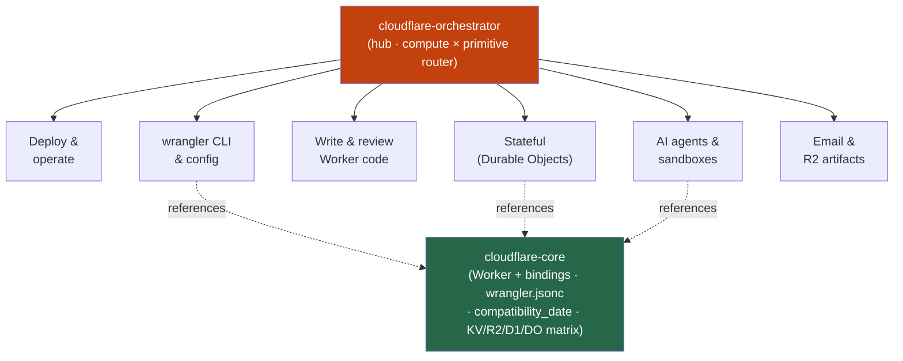

<div align="center">


</div>

<div align="center">

[](../../LICENSE)
[](../../skills.sh.json)
[](https://developers.cloudflare.com/workers/)
[](https://skills.sh/)

**The edge cluster — 9 Cloudflare specialists behind a single router.**
Building, configuring, or shipping on Cloudflare's edge? The orchestrator places your task on the
**compute × primitive** map and routes; `cloudflare-core` holds the binding + config model they all share.

</div>


## What it is

11 skills: `cloudflare-orchestrator` (router) + `cloudflare-core` (shared model) + 9 existing
specialists. The cluster's job is to make a broad, fast-moving platform *navigable* — the
orchestrator knows which spoke to reach for, and the core keeps the interlocking concepts
(Workers/Pages compute, bindings, `compatibility_date`, the KV/R2/D1/DO storage choice) consistent.



## Skills by concern

| Concern | Spokes |
|---|---|
| **Router / model** | `cloudflare-orchestrator`, `cloudflare-core` |
| **Deploy & operate** | `cloudflare`, `cloudflare-manager` |
| **CLI & config** | `wrangler` |
| **Write & review code** | `workers-best-practices` |
| **Stateful coordination** | `durable-objects` |
| **AI agents & sandboxes** | `agents-sdk`, `sandbox-sdk` |
| **Email & R2 artifacts** | `cloudflare-email-service`, `r2-notebooklm-artifact-portal` |

## The model that ties it together

Everything is **compute at the edge reaching primitives only through bindings**:

```
Request ──> Worker / Pages Function ──binding──> KV · R2 · D1 · Durable Object · Queue · AI · send_email
                                       (declared in wrangler.jsonc, pinned by compatibility_date)
```

Declare every dependency as a binding; pick the right primitive (KV = read-heavy cache,
R2 = objects, D1 = relational, Durable Object = strongly-consistent per-entity state); pin
`compatibility_date` and `wrangler types` after changes. Full model in
[`cloudflare-core`](../../skills/cloudflare-core/SKILL.md).

## Install

```bash
npx skills add Sheshiyer/skill-clusters@cloudflare-orchestrator -g -y   # entry point
npx skills add Sheshiyer/skill-clusters@durable-objects -g -y           # any spoke
```

## Local development

Part of the [`skill-clusters`](../../README.md) monorepo; the repo is the single source of truth.

```bash
./scripts/link-agents.sh --apply    # symlink ~/.agents/skills → these canonical copies
```
