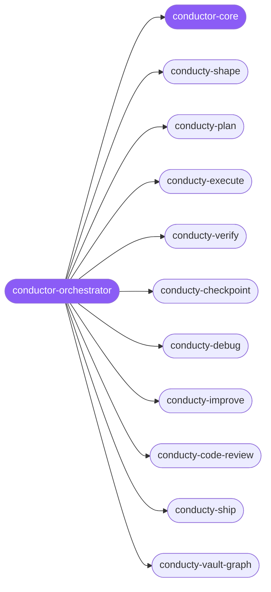

<div align="center">

</div>

<div align="center">

[](../../profiles.json)
[](#skills)
[](../../NOTICE)
[](https://skills.sh/)

</div>

> Runs a spec-driven build through the closed conductor loop — shape → plan → execute → verify → improve → review → ship — dispatching each task to the right skill-cluster and closing the feedback loop. Four organs combine: conducty conducts the loop, PAI triages and enforces fail-closed gates around it, spec-kit fronts it, and skill-clusters resolves which capability runs each task.

## Hub-and-spoke



_…and 9 more in the table below._

## Skills

| Skill | Role | Loaded at startup |
|---|---|---|
| `conductor-orchestrator` | 🧭 hub · router | ✅ enumerated |
| `conductor-core` | 📐 hub · shared reference | ✅ enumerated |
| `conducty-bootstrap` | spoke | ⤵ on-demand |
| `conducty-checkpoint` | spoke | ⤵ on-demand |
| `conducty-code-review` | spoke | ⤵ on-demand |
| `conducty-context` | spoke | ⤵ on-demand |
| `conducty-debug` | spoke | ⤵ on-demand |
| `conducty-dialectic` | spoke | ⤵ on-demand |
| `conducty-execute` | spoke | ⤵ on-demand |
| `conducty-improve` | spoke | ⤵ on-demand |
| `conducty-obsidian` | spoke | ⤵ on-demand |
| `conducty-plan` | spoke | ⤵ on-demand |
| `conducty-review` | spoke | ⤵ on-demand |
| `conducty-shape` | spoke | ⤵ on-demand |
| `conducty-ship` | spoke | ⤵ on-demand |
| `conducty-system` | spoke | ⤵ on-demand |
| `conducty-tdd` | spoke | ⤵ on-demand |
| `conducty-terse` | spoke | ⤵ on-demand |
| `conducty-vault-graph` | spoke | ⤵ on-demand |
| `conducty-verify` | spoke | ⤵ on-demand |
| `conducty-worktrees` | spoke | ⤵ on-demand |

## Tier & loading

Enumerated at CLI startup (orchestrator + core); spokes load on demand from `~/.agents/skill-clusters/skills/<name>/SKILL.md`.

## Install

```bash
npx skills add Sheshiyer/skill-clusters@conductor-orchestrator -g -y
```

## Attribution

The conductor loop spokes derive from [robertbarclayy/conducty](../../NOTICE) (MIT); the `conductor-orchestrator` and `conductor-core` integration layer is authored for skill-clusters (MIT).

---
<sub>Part of <a href="../../README.md">skill-clusters</a> — the conductor closed-loop system · <a href="../../docs/CONDUCTOR-INTEGRATION.md">how it's wired</a></sub>
