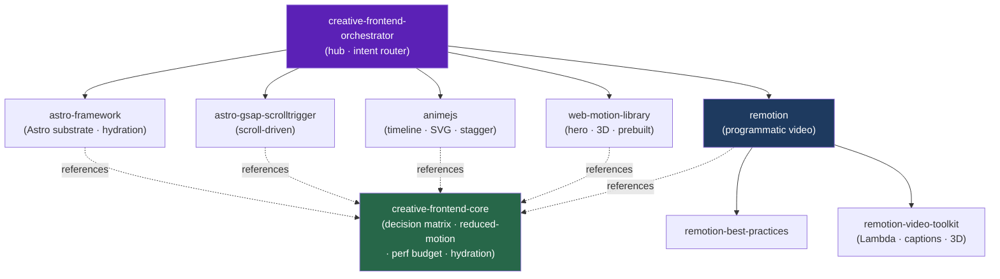

<div align="center">


</div>

<div align="center">

[](../../LICENSE)
[](../../skills.sh.json)
[](https://skills.sh/)
[](https://github.com/Sheshiyer/skill-clusters/commits/main)

**A hub-and-spoke cluster of agent skills for animated, content-driven Astro sites and programmatic video.**
Ask for a scroll effect, a hero animation, or "make me a promo video" — the orchestrator decides
**in-browser vs. render-time** and routes to the right spoke, over one shared core.

</div>


## What it is

Nine skills around a single entry point. `creative-frontend-orchestrator` classifies the
deliverable — **a live interactive effect, or a rendered video file?** — and delegates.
The in-browser spokes (GSAP ScrollTrigger, Anime.js, web-motion-library) animate over an
**Astro** substrate; the Remotion sub-trio renders video. `creative-frontend-core` holds
everything they share — the decision matrix, `prefers-reduced-motion` baseline, GPU/performance
budget, and Astro hydration boundaries — so nothing is duplicated or contradicted.



## Skills

| Skill | Role | Area |
|---|---|---|
| `creative-frontend-orchestrator` | Hub / router | Deliverable → in-browser vs. video → spoke |
| `creative-frontend-core` | Shared reference | Decision matrix, reduced-motion, perf budget, hydration, versions |
| `astro-framework` | Substrate | Astro components, islands/hydration, content, view transitions, deploy |
| `astro-gsap-scrolltrigger` | In-browser | Scroll: pin, scrub, parallax, reveal — view-transition-safe |
| `animejs` | In-browser | Timeline, SVG draw/morph, stagger, JS tweening |
| `web-motion-library` | In-browser | Pre-built hero / 3D / WebGL / Framer-Motion components |
| `remotion` | Render-time | Programmatic video in React (entry) |
| `remotion-best-practices` | Render-time | Conventions, gotchas, rules |
| `remotion-video-toolkit` | Render-time | Lambda/Cloud Run rendering, captions, 3D, charts |

## The one decision that routes everything

| Question | If YES |
|---|---|
| Responds to user input (scroll/hover/click/drag) in real time? | **in-browser** |
| Must be a file (`.mp4`/`.webm`/`.gif`) to upload/embed? | **Remotion** |
| Needs deterministic frame timing / audio sync? | **Remotion** |
| N data-driven variants (per-user/product/locale)? | **Remotion** |
| One-off effect on a live page? | **in-browser** |

Full matrix, in-browser tool selection, and the reduced-motion / perf / hydration rules live in
[`creative-frontend-core`](../../skills/creative-frontend-core/SKILL.md).

## Install

```bash
# whole cluster (entry point + spokes)
npx skills add Sheshiyer/skill-clusters@creative-frontend-orchestrator -g -y

# or a single spoke
npx skills add Sheshiyer/skill-clusters@astro-gsap-scrolltrigger -g -y
```

Then just describe the motion/video you want — the orchestrator routes it.

## Local development

This cluster is part of the [`skill-clusters`](../../README.md) monorepo. The repo is the
**single source of truth**; to point your local agent runtime (`~/.agents/skills`) at these
canonical copies:

```bash
./scripts/link-agents.sh            # preview (safe, no changes)
./scripts/link-agents.sh --apply    # symlink ~/.agents/skills → repo (originals backed up)
```
