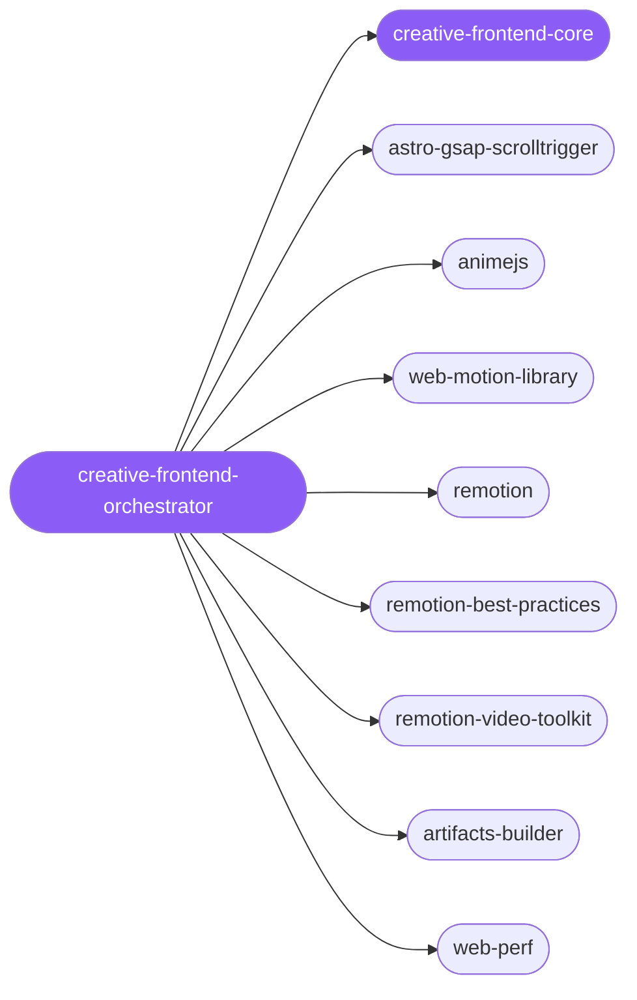

<div align="center">

</div>

<div align="center">

[](../../profiles.json)
[](#skills)
[](../../NOTICE)
[](https://skills.sh/)

</div>

> The single entry point for animated / motion / video frontend work. It answers the one question that determines everything downstream — **live interactive effect, or rendered video file?** — then routes to the right spoke: in-browser animation (GSAP ScrollTrigger, Anime.js, web-motion-library) over an Astro substrate, or render-time programmatic video (Remotion). Shared rules — decision matrix, reduced-motion baseline, GPU/performance budget, Astro hydration boundaries — live in `creative-frontend-core`.

## Hub-and-spoke



## Skills

| Skill | Role | Loaded at startup |
|---|---|---|
| `creative-frontend-orchestrator` | 🧭 hub · router | ✅ enumerated |
| `creative-frontend-core` | 📐 hub · shared reference | ✅ enumerated |
| `astro-gsap-scrolltrigger` | spoke | ⤵ on-demand |
| `animejs` | spoke | ⤵ on-demand |
| `web-motion-library` | spoke | ⤵ on-demand |
| `remotion` | spoke | ⤵ on-demand |
| `remotion-best-practices` | spoke | ⤵ on-demand |
| `remotion-video-toolkit` | spoke | ⤵ on-demand |
| `artifacts-builder` | spoke | ⤵ on-demand |
| `web-perf` | spoke | ⤵ on-demand |

## Tier & loading

Enumerated at CLI startup (orchestrator + core); spokes load on demand from `~/.agents/skill-clusters/skills/<name>/SKILL.md`.

## Install

```bash
npx skills add Sheshiyer/skill-clusters@creative-frontend-orchestrator -g -y
```

## Attribution

Authored for skill-clusters (MIT). See [../../NOTICE](../../NOTICE).

---
<sub>Part of <a href="../../README.md">skill-clusters</a> — the conductor closed-loop system · <a href="../../docs/CONDUCTOR-INTEGRATION.md">how it's wired</a></sub>
