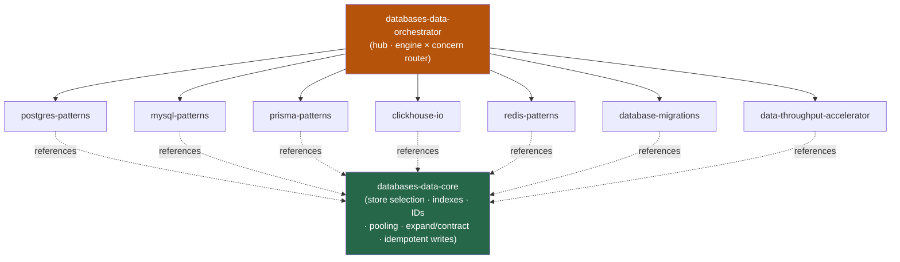

<div align="center">


</div>

<div align="center">

[](../../LICENSE)
[](../../skills.sh.json)
[](https://www.postgresql.org)
[](https://clickhouse.com)
[](https://redis.io)
[](https://skills.sh/)

**7 data-layer specialists behind a single router.**
Designing, querying, optimizing, migrating, or moving data? The orchestrator places your
task on the **engine × concern** map and routes; `databases-data-core` holds the
store-selection model and conventions they all share.

</div>


## What it is

9 skills: `databases-data-orchestrator` (router) + `databases-data-core` (shared model) +
7 specialists. The cluster's job is to make the data layer *navigable* — the orchestrator
knows which store and concern your task belongs to, and the core keeps the interlocking
decisions (store selection, index choice, ID strategy, pooling, expand/contract
migrations, idempotent writes) consistent across every spoke.



## Skills by concern

| Concern | Spokes |
|---|---|
| **Router / model** | `databases-data-orchestrator`, `databases-data-core` |
| **Relational (OLTP)** | `postgres-patterns`, `mysql-patterns`, `prisma-patterns` |
| **Analytics (OLAP)** | `clickhouse-io` |
| **In-memory (cache · locks · queues)** | `redis-patterns` |
| **Schema change** | `database-migrations` |
| **Move data fast** | `data-throughput-accelerator` |

## The model that ties it together

Match the **store to the access pattern** before writing any schema:

```
Workload ──is──> { OLTP rows · OLAP scans · in-memory · ORM-managed } ──picks──> Store
```

Never run analytics off your OLTP primary, Redis is never the system of record, and an ORM
is a convenience *over* a relational engine — you still own the index and pool decisions.
Full model in [`databases-data-core`](../../skills/databases-data-core/SKILL.md).

## Install

```bash
npx skills add Sheshiyer/skill-clusters@databases-data-orchestrator -g -y   # entry point
npx skills add Sheshiyer/skill-clusters@postgres-patterns -g -y             # any spoke
```

## Local development

Part of the [`skill-clusters`](../../README.md) monorepo; the repo is the single source of truth.

```bash
./scripts/link-agents.sh --apply    # symlink ~/.agents/skills → these canonical copies
```
