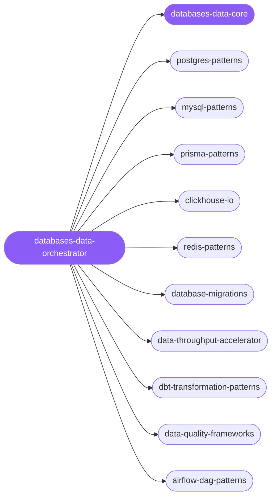

<div align="center">

</div>

<div align="center">

[](../../profiles.json)
[](#skills)
[](../../NOTICE)
[](https://skills.sh/)

</div>

> The single entry point for database and data-layer work. It locates a task on the **engine × concern** map — PostgreSQL, MySQL/MariaDB, the Prisma ORM, Redis, ClickHouse analytics, migrations, ingestion/ETL — and delegates to the right specialist. The cross-cutting decision every data task starts from, *which store fits this workload* (OLTP vs OLAP vs cache vs ORM-managed), plus the shared conventions (index choice, ID strategy, pooling, expand/contract migrations, idempotent bulk writes), live in `databases-data-core`.

## Hub-and-spoke



_…and 14 more in the table below._

## Skills

| Skill | Role | Loaded at startup |
|---|---|---|
| `databases-data-orchestrator` | 🧭 hub · router | ✅ enumerated |
| `databases-data-core` | 📐 hub · shared reference | ✅ enumerated |
| `postgres-patterns` | spoke | ⤵ on-demand |
| `mysql-patterns` | spoke | ⤵ on-demand |
| `prisma-patterns` | spoke | ⤵ on-demand |
| `clickhouse-io` | spoke | ⤵ on-demand |
| `redis-patterns` | spoke | ⤵ on-demand |
| `database-migrations` | spoke | ⤵ on-demand |
| `data-throughput-accelerator` | spoke | ⤵ on-demand |
| `airflow-dag-patterns` | spoke | ⤵ on-demand |
| `backtesting-frameworks` | spoke | ⤵ on-demand |
| `data-quality-frameworks` | spoke | ⤵ on-demand |
| `data-storytelling` | spoke | ⤵ on-demand |
| `dbt-transformation-patterns` | spoke | ⤵ on-demand |
| `kpi-dashboard-design` | spoke | ⤵ on-demand |
| `ml-pipeline-workflow` | spoke | ⤵ on-demand |
| `postgresql` | spoke | ⤵ on-demand |
| `risk-metrics-calculation` | spoke | ⤵ on-demand |
| `spark-optimization` | spoke | ⤵ on-demand |
| `biopython` | spoke | ⤵ on-demand |
| `data-structure-protocol` | spoke | ⤵ on-demand |
| `dbos-golang` | spoke | ⤵ on-demand |
| `dbos-python` | spoke | ⤵ on-demand |
| `dbos-typescript` | spoke | ⤵ on-demand |
| `neon-postgres` | spoke | ⤵ on-demand |
| `networkx` | spoke | ⤵ on-demand |

## Tier & loading

Enumerated at CLI startup (orchestrator + core); spokes load on demand from `~/.agents/skill-clusters/skills/<name>/SKILL.md`.

## Install

```bash
npx skills add Sheshiyer/skill-clusters@databases-data-orchestrator -g -y
```

## Attribution

Authored for skill-clusters (MIT) + mixed: the engine, migration, and throughput spokes derive from affaan-m/ECC (MIT), and several picked-up specialists from antigravity-awesome-skills (MIT). See [NOTICE](../../NOTICE).

---
<sub>Part of <a href="../../README.md">skill-clusters</a> — the conductor closed-loop system · <a href="../../docs/CONDUCTOR-INTEGRATION.md">how it's wired</a></sub>
