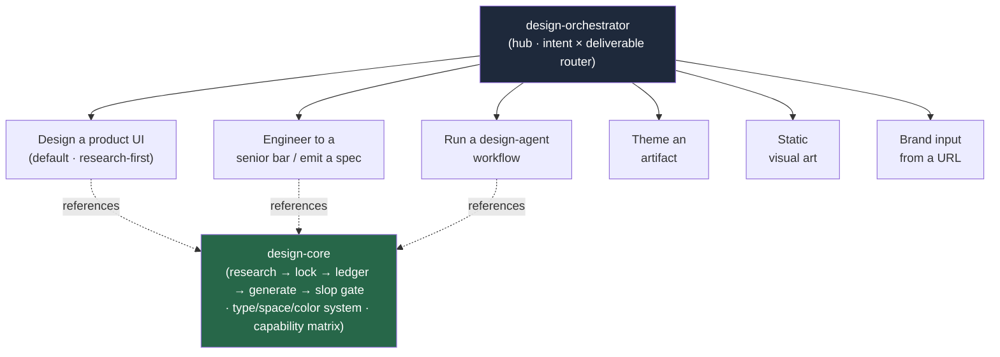

<div align="center">


</div>

<div align="center">

[](../../LICENSE)
[](../../skills.sh.json)
[](../../profiles.json)
[](https://skills.sh/)

**A craft cluster — 9 design specialists behind a single router.**
Designing, styling, redesigning, or polishing an interface, artifact, or brand surface? The
orchestrator places your task on the **intent × deliverable** map and routes; `design-core`
holds the research-first gate they all share.

</div>


## What it is

11 skills: `design-orchestrator` (router) + `design-core` (shared model) + 9 existing
specialists. The cluster's job is to make a strong-but-scattered design skill set *navigable* —
the orchestrator knows which of the 9 to reach for, and the core keeps the one rule that
matters (**research and constraints before generation**, the decision ledger, the anti-AI-slop
gate) consistent across all of them.



## Skills by intent

| Intent | Spokes |
|---|---|
| **Router / model** | `design-orchestrator`, `design-core` |
| **Design a product UI** | `refero-design` (default, research-first), `ui-ux-pro-max` (design-intelligence DB), `swiss-design` (modernist Tailwind system) |
| **Engineer / spec** | `taste-skill` (senior rules + perf), `stitch-design-taste` (emits `DESIGN.md`) |
| **Workflow** | `superdesign` (drafts · branch variations · multi-page flows) |
| **Theme an artifact** | `theme-factory` (slides · docs · reports · HTML) |
| **Static art** | `canvas-design` (`.png` / `.pdf` posters & art) |
| **Brand input** | `openbrand` (logos · colors · backdrops · name from a URL) |

## The rule that ties it together

A design is **grounded, never averaged**:

```
Research references ──> Lock a direction ──> Record decisions (ledger) ──> Generate ──> Check against the slop gate
```

"Make it look good" means *find references and commit to a direction* — not improvise from the
model's defaults. Full model and the anti-AI-slop gate in
[`design-core`](../../skills/design-core/SKILL.md).

## Install

```bash
npx skills add Sheshiyer/skill-clusters@design-orchestrator -g -y     # entry point
npx skills add Sheshiyer/skill-clusters@refero-design -g -y           # any spoke
```

## Local development

Part of the [`skill-clusters`](../../README.md) monorepo; the repo is the single source of truth.

```bash
./scripts/link-agents.sh --apply    # symlink ~/.agents/skills → these canonical copies
```
