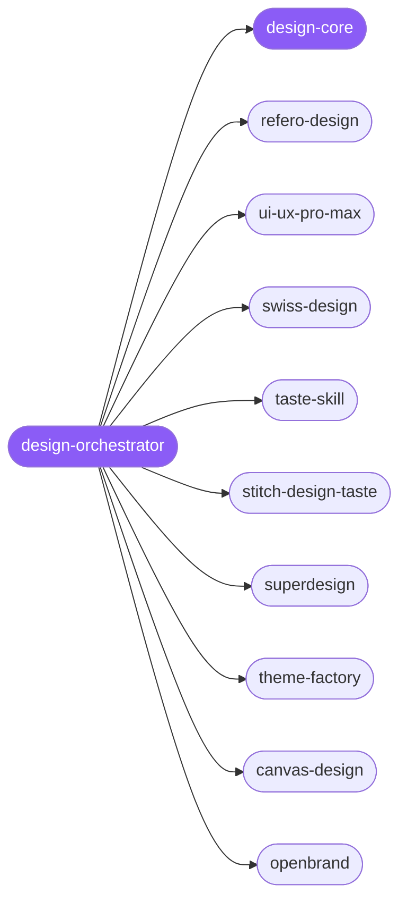

<div align="center">

</div>

<div align="center">

[](../../profiles.json)
[](#skills)
[](../../NOTICE)
[](https://skills.sh/)

</div>

> The single entry point for design work: it locates a task on the **intent × deliverable** map — product UI, spec, themed artifact, static art, or brand data — and delegates to one of 9 specialist spokes. The cross-cutting model every design shares — **research and constraints before generation**, the decision ledger, and the anti-AI-slop quality gate — lives in `design-core` and is read before any pixels are generated.

## Hub-and-spoke



## Skills

| Skill | Role | Loaded at startup |
|---|---|---|
| `design-orchestrator` | 🧭 hub · router | ✅ enumerated |
| `design-core` | 📐 hub · shared reference | ✅ enumerated |
| `refero-design` | spoke | ⤵ on-demand |
| `ui-ux-pro-max` | spoke | ⤵ on-demand |
| `swiss-design` | spoke | ⤵ on-demand |
| `taste-skill` | spoke | ⤵ on-demand |
| `stitch-design-taste` | spoke | ⤵ on-demand |
| `superdesign` | spoke | ⤵ on-demand |
| `theme-factory` | spoke | ⤵ on-demand |
| `canvas-design` | spoke | ⤵ on-demand |
| `openbrand` | spoke | ⤵ on-demand |

## Tier & loading

Enumerated at CLI startup (orchestrator + core); spokes load on demand from `~/.agents/skill-clusters/skills/<name>/SKILL.md`.

## Install

```bash
npx skills add Sheshiyer/skill-clusters@design-orchestrator -g -y
```

## Attribution

Authored for skill-clusters (MIT) — the clustering, the orchestrator, and the core are original to this repo. + mixed: several spokes carry their own upstream authorship (e.g. `refero-design` → referodesign, `swiss-design` → zeke, `superdesign`), preserved in each skill's frontmatter and body. See [NOTICE](../../NOTICE).

---
<sub>Part of <a href="../../README.md">skill-clusters</a> — the conductor closed-loop system · <a href="../../docs/CONDUCTOR-INTEGRATION.md">how it's wired</a></sub>
