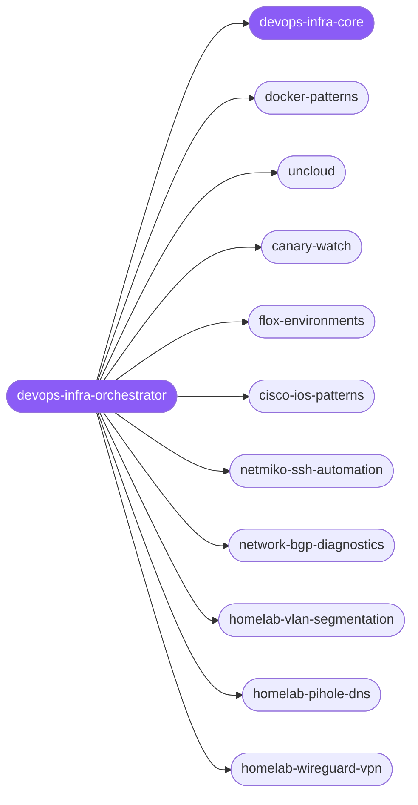

<div align="center">

</div>

<div align="center">

[](../../profiles.json)
[](#skills)
[](../../NOTICE)
[](https://skills.sh/)

</div>

> The single entry skill for infrastructure work. It locates a task on the **layer × operation** map — containers & compose, self-hosting clusters, post-deploy canary checks, reproducible dev environments, enterprise network-device diagnostics, and homelab networking — and delegates to one specialist spoke, with the read-only-by-default / change-window-for-mutations safety boundary (defined in `devops-infra-core`) shared across all of them.

## Hub-and-spoke



_…and 12 more in the table below._

## Skills

| Skill | Role | Loaded at startup |
|---|---|---|
| `devops-infra-orchestrator` | 🧭 hub · router | ✅ enumerated |
| `devops-infra-core` | 📐 hub · shared reference | ✅ enumerated |
| `aws-serverless` | spoke | ⤵ on-demand |
| `azure-functions` | spoke | ⤵ on-demand |
| `canary-watch` | spoke | ⤵ on-demand |
| `cisco-ios-patterns` | spoke | ⤵ on-demand |
| `devcontainer-setup` | spoke | ⤵ on-demand |
| `docker-patterns` | spoke | ⤵ on-demand |
| `flox-environments` | spoke | ⤵ on-demand |
| `gcp-cloud-run` | spoke | ⤵ on-demand |
| `healthcheck` | spoke | ⤵ on-demand |
| `homelab-network-setup` | spoke | ⤵ on-demand |
| `homelab-pihole-dns` | spoke | ⤵ on-demand |
| `homelab-vlan-segmentation` | spoke | ⤵ on-demand |
| `homelab-wireguard-vpn` | spoke | ⤵ on-demand |
| `inngest` | spoke | ⤵ on-demand |
| `netmiko-ssh-automation` | spoke | ⤵ on-demand |
| `network-bgp-diagnostics` | spoke | ⤵ on-demand |
| `network-config-validation` | spoke | ⤵ on-demand |
| `network-interface-health` | spoke | ⤵ on-demand |
| `terraform-skill` | spoke | ⤵ on-demand |
| `uncloud` | spoke | ⤵ on-demand |
| `upstash-qstash` | spoke | ⤵ on-demand |
| `voice-ai-development` | spoke | ⤵ on-demand |

## Tier & loading

Enumerated at CLI startup (orchestrator + core); spokes load on demand from `~/.agents/skill-clusters/skills/<name>/SKILL.md`.

## Install

```bash
npx skills add Sheshiyer/skill-clusters@devops-infra-orchestrator -g -y
```

## Attribution

Primarily authored for skill-clusters (MIT) + mixed — includes spokes from antigravity-awesome-skills (MIT) and affaan-m/ECC (MIT). See [NOTICE](../../NOTICE).

---
<sub>Part of <a href="../../README.md">skill-clusters</a> — the conductor closed-loop system · <a href="../../docs/CONDUCTOR-INTEGRATION.md">how it's wired</a></sub>
