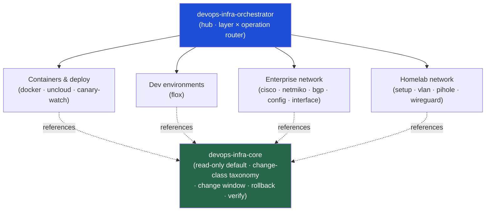

<div align="center">


</div>

<div align="center">

[](../../LICENSE)
[](../../skills.sh.json)
[](https://docs.docker.com/compose/)
[](https://www.wireguard.com)
[](https://www.cisco.com)
[](https://skills.sh/)

**13 infrastructure specialists behind a single router.**
Provisioning containers, diagnosing a flapping link, segmenting a home network, or verifying a
deploy? The orchestrator places your task on the **layer × operation** map and routes;
`devops-infra-core` holds the read-only-by-default safety boundary they all share.

</div>


## What it is

15 skills: `devops-infra-orchestrator` (router) + `devops-infra-core` (shared model) + 13
specialists spanning containers, self-hosting, dev environments, enterprise network devices, and
homelab networking. The cluster makes a broad skill set *navigable* — the orchestrator knows
which specialist to reach for, and the core keeps the one interlocking rule (diagnose read-only
→ change in a window → verify → rollback) consistent across every spoke, from a Cisco router to a
`docker compose up` to a WireGuard tunnel.



## Skills by layer

| Layer | Spokes |
|---|---|
| **Router / model** | `devops-infra-orchestrator`, `devops-infra-core` |
| **Containers & deploy** | `docker-patterns`, `uncloud`, `canary-watch` |
| **Dev environments** | `flox-environments` |
| **Enterprise network devices** | `cisco-ios-patterns`, `netmiko-ssh-automation`, `network-bgp-diagnostics`, `network-config-validation`, `network-interface-health` |
| **Homelab networking** | `homelab-network-setup`, `homelab-vlan-segmentation`, `homelab-pihole-dns`, `homelab-wireguard-vpn` |

## The model that ties it together

Every spoke turns on **one decision** — is this action read-only, or does it change state?

```
DIAGNOSE (read-only) ──> PLAN change + rollback ──> CHANGE WINDOW ──> VERIFY ──> rollback if regressed
```

The default path on any device, cluster, or deploy is read-only evidence collection; a mutation
— a config line, a firewall/VLAN rule, a `uc` deploy, a port opened — is gated behind a window
with a rollback and out-of-band access secured first. Full model and the change-class taxonomy in
[`devops-infra-core`](../../skills/devops-infra-core/SKILL.md).

## Install

```bash
npx skills add Sheshiyer/skill-clusters@devops-infra-orchestrator -g -y   # entry point
npx skills add Sheshiyer/skill-clusters@homelab-vlan-segmentation -g -y   # any spoke
```

## Local development

Part of the [`skill-clusters`](../../README.md) monorepo; the repo is the single source of truth.

```bash
./scripts/link-agents.sh --apply    # symlink ~/.agents/skills → these canonical copies
```
