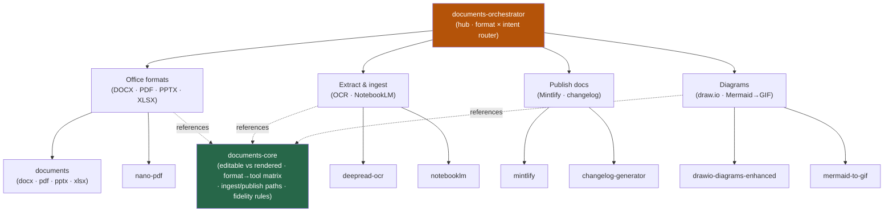

<div align="center">


</div>

<div align="center">

[](../../LICENSE)
[](../../skills.sh.json)
[](../../README.md)
[](https://skills.sh/)

**Office formats, extraction, publishing, and diagrams behind a single router.**
Creating, editing, extracting from, or rendering a document? The orchestrator places your task on
the **format × intent** map and routes; `documents-core` holds the editable-vs-rendered decision
they all share.

</div>


## What it is

10 skills: `documents-orchestrator` (router) + `documents-core` (shared model) + 8 specialists.
The cluster's job is to make a sprawl of document tools *navigable* — the orchestrator knows
which spoke to reach for, and the core keeps the one decision that governs every task
(**editable source vs rendered artifact**) consistent so no spoke contradicts another.



## Skills by concern

| Concern | Spokes |
|---|---|
| **Router / model** | `documents-orchestrator`, `documents-core` |
| **Office formats** | `documents` (bundles `docx` · `pdf` · `pptx` · `xlsx` + Playwright HTML→PDF report pipeline), `nano-pdf` |
| **Extract & ingest** | `deepread-ocr`, `notebooklm` |
| **Publish docs** | `mintlify`, `changelog-generator` |
| **Diagrams** | `drawio-diagrams-enhanced`, `mermaid-to-gif` |

## The decision that ties it together

Every document is in one of two modes, and the mode is a one-way door:

```
Editable source  ──(render)──>  Rendered artifact
  (OOXML · openpyxl ·              (Playwright PDF · OCR text ·
   .drawio XML · .md)               flattened PDF · GIF)
  round-trippable                   pixel/print fidelity — can't edit back
```

Stay editable as long as the user might edit again; render only at the last step, and never
overwrite the original with its render. Full model in
[`documents-core`](../../skills/documents-core/SKILL.md).

## Install

```bash
npx skills add Sheshiyer/skill-clusters@documents-orchestrator -g -y     # entry point
npx skills add Sheshiyer/skill-clusters@deepread-ocr -g -y               # any spoke
```

## Local development

Part of the [`skill-clusters`](../../README.md) monorepo; the repo is the single source of truth.

```bash
./scripts/link-agents.sh --apply    # symlink ~/.agents/skills → these canonical copies
```
