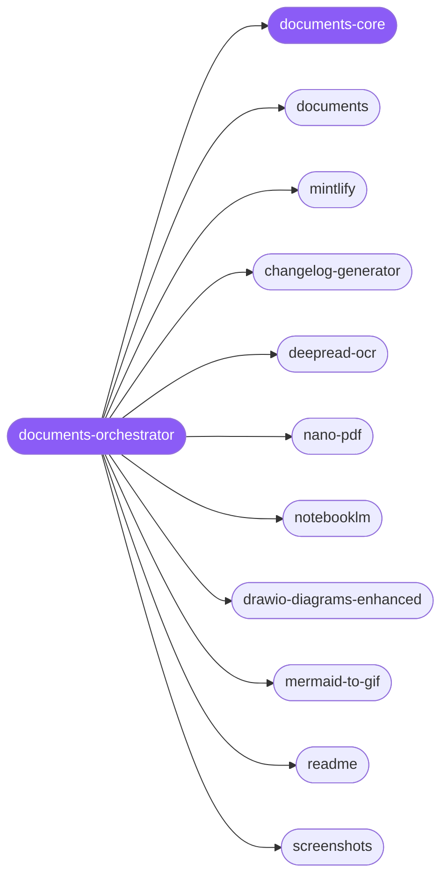

<div align="center">

</div>

<div align="center">

[](../../profiles.json)
[](#skills)
[](../../NOTICE)
[](https://skills.sh/)

</div>

> Routes a document task to the right specialist — office formats (DOCX/PDF/PPTX/XLSX), docs sites, changelogs, OCR extraction, natural-language PDF edits, NotebookLM, and diagram authoring. Every task first turns on one decision held in `documents-core`: keep the **editable source** (round-trippable, structure preserved) or produce a **rendered artifact** (pixel-fidelity output you can't edit back) — and that call locks which spoke can touch the file next.

## Hub-and-spoke



## Skills

| Skill | Role | Loaded at startup |
|---|---|---|
| `documents-orchestrator` | 🧭 hub · router | ✅ enumerated |
| `documents-core` | 📐 hub · shared reference | ✅ enumerated |
| `documents` | spoke | ⤵ on-demand |
| `mintlify` | spoke | ⤵ on-demand |
| `changelog-generator` | spoke | ⤵ on-demand |
| `deepread-ocr` | spoke | ⤵ on-demand |
| `nano-pdf` | spoke | ⤵ on-demand |
| `notebooklm` | spoke | ⤵ on-demand |
| `drawio-diagrams-enhanced` | spoke | ⤵ on-demand |
| `mermaid-to-gif` | spoke | ⤵ on-demand |
| `readme` | spoke | ⤵ on-demand |
| `screenshots` | spoke | ⤵ on-demand |

## Tier & loading

Off by default — 0 startup cost. Activate with `node scripts/tier.mjs --activate documents --apply`.

## Install

```bash
npx skills add Sheshiyer/skill-clusters@documents-orchestrator -g -y
```

## Attribution

Authored for skill-clusters (MIT) — see [NOTICE](../../NOTICE). + mixed: the `readme` and `screenshots` spokes originate from antigravity-awesome-skills (MIT).

---
<sub>Part of <a href="../../README.md">skill-clusters</a> — the conductor closed-loop system · <a href="../../docs/CONDUCTOR-INTEGRATION.md">how it's wired</a></sub>
