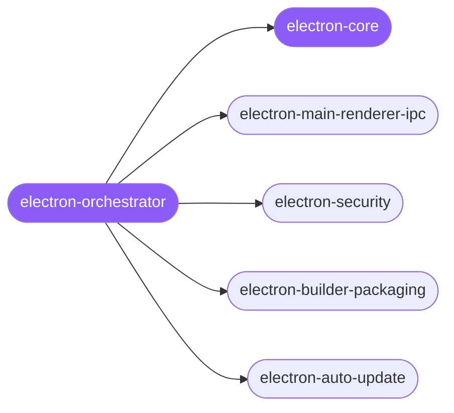

<div align="center">

</div>

<div align="center">

[](../../profiles.json)
[](#skills)
[](../../NOTICE)
[](https://skills.sh/)

</div>

> Routes any Electron desktop-app task (Chromium renderers + Node.js main) onto the process × concern map — IPC, the context-isolation security boundary, packaging/signing/notarization, auto-update, or native modules. Every rule turns on one fact: the renderer runs web content and is untrusted; the main process holds Node/OS power.

## Hub-and-spoke



## Skills

| Skill | Role | Loaded at startup |
|---|---|---|
| `electron-orchestrator` | 🧭 hub · router | ✅ enumerated |
| `electron-core` | 📐 hub · shared reference | ✅ enumerated |
| `electron-main-renderer-ipc` | spoke | ⤵ on-demand |
| `electron-security` | spoke | ⤵ on-demand |
| `electron-builder-packaging` | spoke | ⤵ on-demand |
| `electron-auto-update` | spoke | ⤵ on-demand |

## Tier & loading

Enumerated at CLI startup (orchestrator + core); spokes load on demand from `~/.agents/skill-clusters/skills/<name>/SKILL.md`.

## Install

```bash
npx skills add Sheshiyer/skill-clusters@electron-orchestrator -g -y
```

## Attribution

Authored for skill-clusters (MIT). See [NOTICE](../../NOTICE).

---
<sub>Part of <a href="../../README.md">skill-clusters</a> — the conductor closed-loop system · <a href="../../docs/CONDUCTOR-INTEGRATION.md">how it's wired</a></sub>
