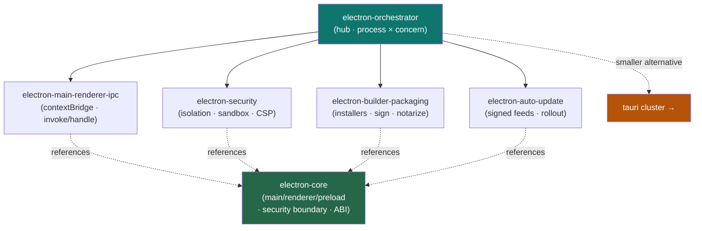

<div align="center">


</div>

<div align="center">

[](../../LICENSE)
[](../../skills.sh.json)
[](https://electronjs.org)
[](https://skills.sh/)

**Hub-and-spoke cluster for Electron desktop apps (Chromium + Node.js).**
The orchestrator routes by process × concern; `electron-core` holds the one decision everything
turns on — the **main/renderer split and the context-isolation security boundary**. For a
smaller Rust/web alternative, see the **[tauri](../tauri)** cluster.

</div>


## What it is

Authored from scratch (ECC shipped no Electron suite) to the same house pattern. Six skills
around one router. Because an Electron app ships a full browser + Node to end users, the
**security checklist is non-optional** — it's the spine of the cluster.



## Skills

| Skill | Role |
|---|---|
| `electron-orchestrator` | Router — process/concern → spoke |
| `electron-core` | Main/renderer/preload model, security boundary, ABI, Electron-vs-Tauri |
| `electron-main-renderer-ipc` | Safe IPC via preload `contextBridge` |
| `electron-security` | The hardening checklist |
| `electron-builder-packaging` | Installers, signing, notarization |
| `electron-auto-update` | Signed update feeds, staged rollout |

## The decision everything turns on

The **renderer is untrusted**; the **main process holds Node/OS power**. Every window:
`contextIsolation: true`, `nodeIntegration: false`, `sandbox: true` — expose only a minimal typed
`contextBridge` API. Full model in [`electron-core`](../../skills/electron-core/SKILL.md).

## Install

```bash
npx skills add Sheshiyer/skill-clusters@electron-orchestrator -g -y
```

## Local development

Part of the [`skill-clusters`](../../README.md) monorepo (repo = single source of truth):

```bash
./scripts/link-agents.sh --apply
```
