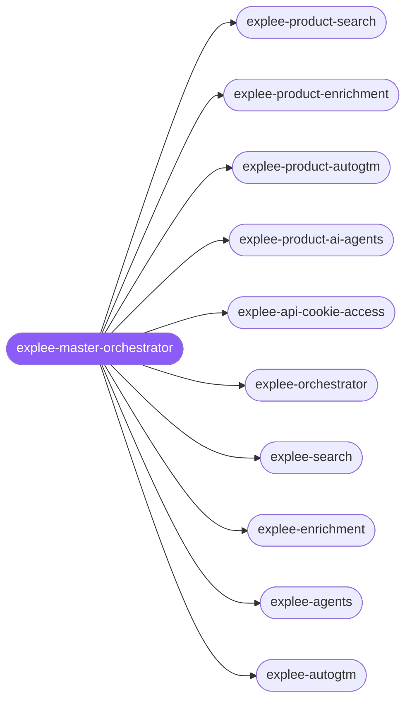

<div align="center">

</div>

<div align="center">

[](../../profiles.json)
[](#skills)
[](../../NOTICE)
[](https://skills.sh/)

</div>

> The Explee product cluster routes GTM and data tasks across Search, Enrichment, AI Agents, AutoGTM, and auth context. It keeps the older product skills and the imported Explee-native skills in one deferred capability surface so Hermes can invoke the right branch without relying on local external symlinks.

## Hub-and-spoke



_...and 2 more in the table below._

## Skills

| Skill | Role | Loaded at startup |
|---|---|---|
| `explee-master-orchestrator` | 🧭 hub · router | ⤵ deferred |
| `explee-product-search` | spoke | ⤵ on-demand |
| `explee-product-enrichment` | spoke | ⤵ on-demand |
| `explee-product-autogtm` | spoke | ⤵ on-demand |
| `explee-product-ai-agents` | spoke | ⤵ on-demand |
| `explee-api-cookie-access` | spoke | ⤵ on-demand |
| `explee-orchestrator` | spoke | ⤵ on-demand |
| `explee-search` | spoke | ⤵ on-demand |
| `explee-enrichment` | spoke | ⤵ on-demand |
| `explee-agents` | spoke | ⤵ on-demand |
| `explee-autogtm` | spoke | ⤵ on-demand |
| `explee-api-core` | spoke | ⤵ on-demand |
| `explee-auth-cookie` | spoke | ⤵ on-demand |

## Tier & loading

Off by default — 0 startup cost. Activate with `node scripts/tier.mjs --activate explee-master --apply`.

## Install

```bash
npx skills add Sheshiyer/skill-clusters@explee-master-orchestrator -g -y
```

## Attribution

Authored for skill-clusters, with imported Explee-native skills from `Sheshiyer/explee-skills`. See [NOTICE](../../NOTICE).

---
<sub>Part of <a href="../../README.md">skill-clusters</a> — the conductor closed-loop system · <a href="../../docs/CONDUCTOR-INTEGRATION.md">how it's wired</a></sub>
