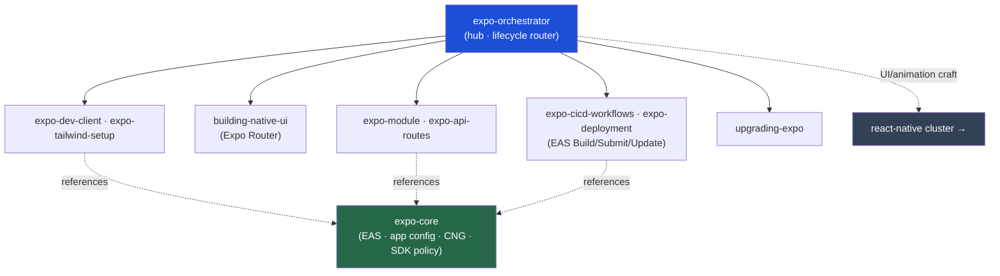

<div align="center">


</div>

<div align="center">

[](../../LICENSE)
[](../../skills.sh.json)
[](https://expo.dev)
[](https://skills.sh/)

**Hub-and-spoke cluster for the Expo toolchain.**
Setting up, building, or shipping an Expo app? The orchestrator routes by lifecycle stage and
`expo-core` holds the platform model (EAS, app config, the managed↔bare spectrum, SDK policy).
Pairs with the **[react-native](../react-native)** cluster for UI/interaction craft.

</div>


## What it is

`expo-orchestrator` (router) + `expo-core` (platform model) + the Expo spokes. The cluster
turns a fuzzy "build/ship my Expo app" into the right step — dev client, Expo Router UI,
in-app API routes, native modules, EAS build/submit/update, SDK upgrades — and keeps the EAS
and config-plugin model consistent across them.



## Skills

| Skill | Role |
|---|---|
| `expo-orchestrator` | Router — lifecycle → spoke |
| `expo-core` | EAS, app config + plugins, managed↔bare, SDK policy |
| `expo-dev-client` | Custom dev client (local / TestFlight) |
| `expo-tailwind-setup` | Tailwind v4 + NativeWind v5 styling |
| `building-native-ui` | App screens with Expo Router |
| `expo-api-routes` | Server API routes + EAS Hosting |
| `expo-module` | Native modules via Expo Modules API |
| `expo-cicd-workflows` | CI for EAS pipelines |
| `expo-deployment` | EAS Build → Submit → Update (OTA) |
| `upgrading-expo` | SDK upgrades + dep alignment |
| `native-data-fetching` | *(shared)* fetch / React Query / SWR / offline |

## The model that ties it together

The **Expo SDK version** is the source of truth (it pins the RN version + native deps);
**EAS Update ships JS only** (native changes need a new build + runtime-version bump); prefer
**config plugins** over manual native edits so prebuild/CNG stays reproducible. Full model in
[`expo-core`](../../skills/expo-core/SKILL.md).

## Install

```bash
npx skills add Sheshiyer/skill-clusters@expo-orchestrator -g -y
```

## Local development

Part of the [`skill-clusters`](../../README.md) monorepo (repo = single source of truth):

```bash
./scripts/link-agents.sh --apply
```
