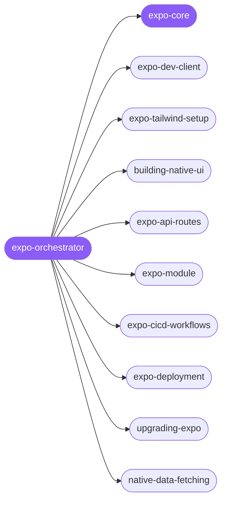

<div align="center">

</div>

<div align="center">

[](../../profiles.json)
[](#skills)
[](../../NOTICE)
[](https://skills.sh/)

</div>

> Routes an Expo task to the right spoke across the app lifecycle — dev environment (dev client, NativeWind), Expo Router app-building, in-app API routes, native modules, EAS build/submit/update, and SDK upgrades. The shared platform model — EAS, app config + config plugins, the Expo Go vs dev-client vs prebuild/CNG spectrum, and SDK version policy — lives in `expo-core`.

## Hub-and-spoke



## Skills

| Skill | Role | Loaded at startup |
|---|---|---|
| `expo-orchestrator` | 🧭 hub · router | ✅ enumerated |
| `expo-core` | 📐 hub · shared reference | ✅ enumerated |
| `expo-dev-client` | spoke | ⤵ on-demand |
| `expo-tailwind-setup` | spoke | ⤵ on-demand |
| `building-native-ui` | spoke | ⤵ on-demand |
| `expo-api-routes` | spoke | ⤵ on-demand |
| `expo-module` | spoke | ⤵ on-demand |
| `expo-cicd-workflows` | spoke | ⤵ on-demand |
| `expo-deployment` | spoke | ⤵ on-demand |
| `upgrading-expo` | spoke | ⤵ on-demand |
| `native-data-fetching` | spoke | ⤵ on-demand |

## Tier & loading

Enumerated at CLI startup (orchestrator + core); spokes load on demand from `~/.agents/skill-clusters/skills/<name>/SKILL.md`.

## Install

```bash
npx skills add Sheshiyer/skill-clusters@expo-orchestrator -g -y
```

## Attribution

Authored for skill-clusters (MIT). See [NOTICE](../../NOTICE).

---
<sub>Part of <a href="../../README.md">skill-clusters</a> — the conductor closed-loop system · <a href="../../docs/CONDUCTOR-INTEGRATION.md">how it's wired</a></sub>
