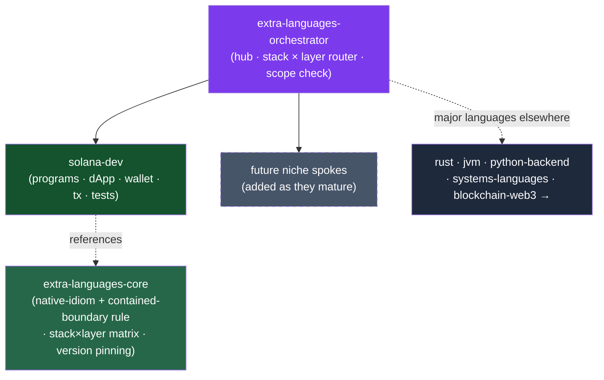

<div align="center">


</div>

<div align="center">

[](../../LICENSE)
[](../../skills.sh.json)
[](../../README.md)
[](https://solana.com)
[](https://skills.sh/)

**Hub-and-spoke cluster for the long tail of language & runtime work.**
The stacks that carry real, version-sensitive knowledge but don't yet warrant their own cluster.
The orchestrator routes by **stack × layer** and decides whether the work even belongs here;
`extra-languages-core` holds the one decision they all turn on — **write the platform's native,
current idiom and contain any legacy/foreign runtime behind an adapter**. For the major languages
see **[rust](../rust)**, **[jvm](../jvm)**, **[python-backend](../python-backend)**, and
**[systems-languages](../systems-languages)**; for EVM see **[blockchain-web3](../blockchain-web3)**.

</div>


## What it is

A **deferred-tier** cluster: it starts thin and grows by absorbing niche specialists as they
mature. Three skills today — `extra-languages-orchestrator` (router) + `extra-languages-core`
(shared discipline) + the kept specialist `solana-dev`. The cluster's job is to give the long
tail a *consistent front door* and one cross-cutting rule, while keeping it honest: when a spoke
outgrows the drawer, it **graduates** to its own cluster instead of bloating this one.



## Skills

| Skill | Role |
|---|---|
| `extra-languages-orchestrator` | Router — scope check + stack/layer → spoke |
| `extra-languages-core` | The native-idiom + contained-boundary decision, stack×layer matrix, version-pinning, guardrails |
| `solana-dev` | End-to-end Solana — kit-first dApp UI, wallet connect, Anchor/Pinocchio programs, Codama codegen, LiteSVM/Mollusk/Surfpool tests, security, toolchain recovery |

## The decision everything turns on

A niche stack fails by **fighting the platform**, not on algorithms:

```
app code (native idiom) ──> [adapter / compat seam] ──> legacy or foreign runtime
                            ^ types stop here ^
```

Use the stack's **current, blessed** toolkit (for Solana: `@solana/kit` + framework-kit, *not*
`web3.js` by default); when a dependency forces a legacy runtime, isolate it behind one named
adapter so its types never diffuse app-wide. And **pin the toolchain** — this long tail breaks on
version drift more than on logic. Full model in
[`extra-languages-core`](../../skills/extra-languages-core/SKILL.md).

## Install

```bash
npx skills add Sheshiyer/skill-clusters@extra-languages-orchestrator -g -y   # entry point
npx skills add Sheshiyer/skill-clusters@solana-dev -g -y                     # the spoke
```

## Local development

Part of the [`skill-clusters`](../../README.md) monorepo (the repo is the single source of truth):

```bash
./scripts/link-agents.sh --apply    # symlink ~/.agents/skills → these canonical copies
```
