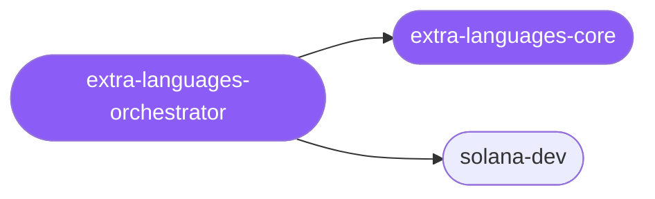

<div align="center">

</div>

<div align="center">

[](../../profiles.json)
[](#skills)
[](../../NOTICE)
[](https://skills.sh/)

</div>

> The entry skill for the **long-tail** of language and runtime work — specialists that don't warrant their own first-class cluster yet but carry real, version-sensitive knowledge. It places a task on the **stack × layer** map, decides whether the work truly belongs here (versus a major-language cluster), and delegates to the right spoke; today the kept specialist is end-to-end Solana on-chain + dApp development.

## Hub-and-spoke



## Skills

| Skill | Role | Loaded at startup |
|---|---|---|
| `extra-languages-orchestrator` | 🧭 hub · router | ✅ enumerated |
| `extra-languages-core` | 📐 hub · shared reference | ✅ enumerated |
| `solana-dev` | spoke | ⤵ on-demand |

## Tier & loading

Off by default — 0 startup cost. Activate with `node scripts/tier.mjs --activate extra-languages --apply`.

## Install

```bash
npx skills add Sheshiyer/skill-clusters@extra-languages-orchestrator -g -y
```

## Attribution

Authored for skill-clusters (MIT). See [NOTICE](../../NOTICE).

---
<sub>Part of <a href="../../README.md">skill-clusters</a> — the conductor closed-loop system · <a href="../../docs/CONDUCTOR-INTEGRATION.md">how it's wired</a></sub>
