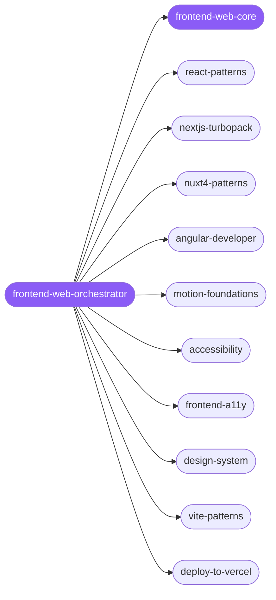

<div align="center">

</div>

<div align="center">

[](../../profiles.json)
[](#skills)
[](../../NOTICE)
[](https://skills.sh/)

</div>

> Routes a web-UI task to the right specialist across the **framework × concern** map — framework choice (React/Next, Vue/Nuxt, Angular), build tooling (Vite, Turbopack, Bun), motion, accessibility, and design direction. The shared decision every spoke inherits — the rendering model (CSR / SSR / RSC / static) that fixes the hydration boundary — lives in `frontend-web-core`, read before picking a framework or wiring SSR-sensitive code.

## Hub-and-spoke



_…and 27 more in the table below._

## Skills

| Skill | Role | Loaded at startup |
|---|---|---|
| `frontend-web-orchestrator` | 🧭 hub · router | ✅ enumerated |
| `frontend-web-core` | 📐 hub · shared reference | ✅ enumerated |
| `react-patterns` | spoke | ⤵ on-demand |
| `react-performance` | spoke | ⤵ on-demand |
| `react-testing` | spoke | ⤵ on-demand |
| `frontend-design-direction` | spoke | ⤵ on-demand |
| `frontend-a11y` | spoke | ⤵ on-demand |
| `accessibility` | spoke | ⤵ on-demand |
| `design-system` | spoke | ⤵ on-demand |
| `make-interfaces-feel-better` | spoke | ⤵ on-demand |
| `ui-to-vue` | spoke | ⤵ on-demand |
| `angular-developer` | spoke | ⤵ on-demand |
| `nextjs-turbopack` | spoke | ⤵ on-demand |
| `nuxt4-patterns` | spoke | ⤵ on-demand |
| `vite-patterns` | spoke | ⤵ on-demand |
| `bun-runtime` | spoke | ⤵ on-demand |
| `frontend-slides` | spoke | ⤵ on-demand |
| `motion-foundations` | spoke | ⤵ on-demand |
| `motion-patterns` | spoke | ⤵ on-demand |
| `motion-advanced` | spoke | ⤵ on-demand |
| `3d-web-experience` | spoke | ⤵ on-demand |
| `algolia-search` | spoke | ⤵ on-demand |
| `awt-e2e-testing` | spoke | ⤵ on-demand |
| `deploy-to-vercel` | spoke | ⤵ on-demand |
| `fp-ts-errors` | spoke | ⤵ on-demand |
| `fp-ts-react` | spoke | ⤵ on-demand |
| `nextjs-supabase-auth` | spoke | ⤵ on-demand |
| …and 11 more | spoke | ⤵ on-demand |

## Tier & loading

Enumerated at CLI startup (orchestrator + core); spokes load on demand from `~/.agents/skill-clusters/skills/<name>/SKILL.md`.

## Install

```bash
npx skills add Sheshiyer/skill-clusters@frontend-web-orchestrator -g -y
```

## Attribution

Primary source: **antigravity-awesome-skills (MIT)** + mixed — also draws on affaan-m/ECC (MIT) and skills authored for skill-clusters (MIT). See [NOTICE](../../NOTICE).

---
<sub>Part of <a href="../../README.md">skill-clusters</a> — the conductor closed-loop system · <a href="../../docs/CONDUCTOR-INTEGRATION.md">how it's wired</a></sub>
