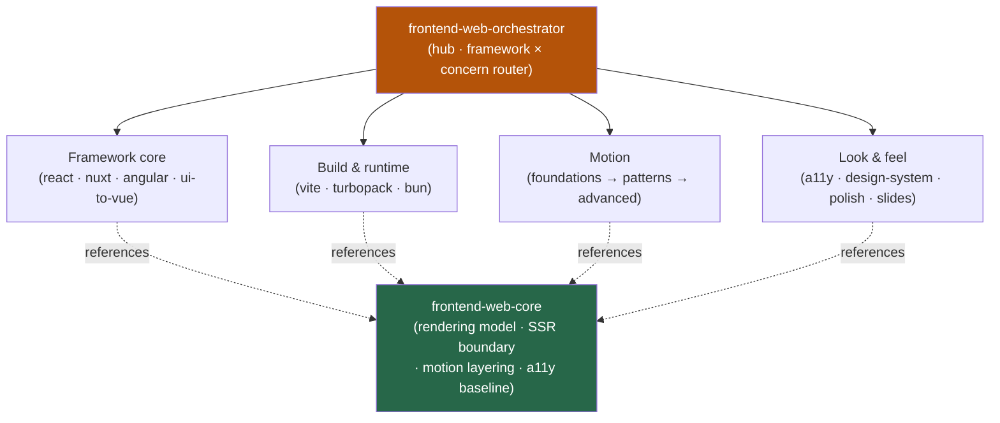

<div align="center">


</div>

<div align="center">

[](../../LICENSE)
[](../../skills.sh.json)
[](https://react.dev)
[](https://nextjs.org)
[](https://vuejs.org)
[](https://skills.sh/)

**18 frontend-web specialists behind a single router.**
Building, reviewing, or shipping a web UI? The orchestrator places your task on the
**framework × concern** map and routes; `frontend-web-core` holds the rendering model they all share.

</div>


## What it is

20 skills: `frontend-web-orchestrator` (router) + `frontend-web-core` (shared model) + 18
specialists. The cluster's job is to make a broad frontend skill set *navigable* — the
orchestrator knows which framework spoke to reach for, and the core keeps the interlocking
concepts (the rendering model, the SSR/`"use client"` boundary, motion layering, the a11y
baseline) consistent across React, Vue/Nuxt, and Angular.



## Skills by concern

| Concern | Spokes |
|---|---|
| **Router / model** | `frontend-web-orchestrator`, `frontend-web-core` |
| **Framework core** | `react-patterns`, `react-performance`, `react-testing`, `nextjs-turbopack`, `nuxt4-patterns`, `angular-developer`, `ui-to-vue` |
| **Build & runtime** | `vite-patterns`, `bun-runtime` |
| **Motion** | `motion-foundations`, `motion-patterns`, `motion-advanced` |
| **Look & feel** | `accessibility`, `frontend-a11y`, `design-system`, `make-interfaces-feel-better`, `frontend-design-direction`, `frontend-slides` |

## The model that ties it together

Decide the **rendering model** first — it fixes the hydration boundary every spoke must respect:

```
Static (SSG) ──► SSR ──► RSC ──► CSR
  most cacheable  ◄──── most interactive ────►
```

Mark stateful and motion code `"use client"`, match server/client initial markup, layer motion
on `motion-foundations`, and keep accessibility (WCAG 2.2 AA + semantic React) as a baseline, not
a follow-up. Full model in
[`frontend-web-core`](../../skills/frontend-web-core/SKILL.md).

## Install

```bash
npx skills add Sheshiyer/skill-clusters@frontend-web-orchestrator -g -y     # entry point
npx skills add Sheshiyer/skill-clusters@react-patterns -g -y                # any spoke
```

## Local development

Part of the [`skill-clusters`](../../README.md) monorepo; the repo is the single source of truth.

```bash
./scripts/link-agents.sh --apply    # symlink ~/.agents/skills → these canonical copies
```
