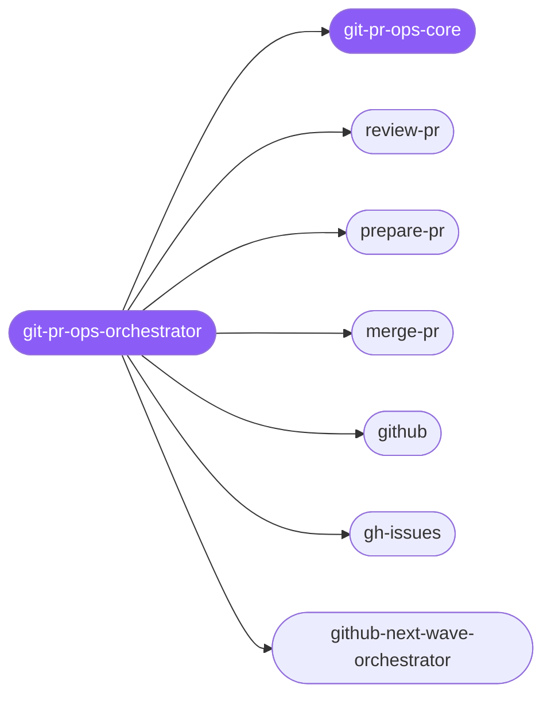

<div align="center">

</div>

<div align="center">

[](../../profiles.json)
[](#skills)
[](../../NOTICE)
[](https://skills.sh/)

</div>

> Routes a GitHub PR or issue task to the right specialist along the **review → prepare → merge** delivery pipeline, plus the issue-driven and reporting lanes that feed it. The shared contract every spoke obeys — the `.local/` artifact handoff, head-SHA pinning, and the push/merge safety rules — lives in `git-pr-ops-core`, read before preparing or merging a PR.

## Hub-and-spoke



## Skills

| Skill | Role | Loaded at startup |
|---|---|---|
| `git-pr-ops-orchestrator` | 🧭 hub · router | ✅ enumerated |
| `git-pr-ops-core` | 📐 hub · shared reference | ✅ enumerated |
| `review-pr` | spoke | ⤵ on-demand |
| `prepare-pr` | spoke | ⤵ on-demand |
| `merge-pr` | spoke | ⤵ on-demand |
| `github` | spoke | ⤵ on-demand |
| `gh-issues` | spoke | ⤵ on-demand |
| `github-next-wave-orchestrator` | spoke | ⤵ on-demand |

## Tier & loading

Enumerated at CLI startup (orchestrator + core); spokes load on demand from `~/.agents/skill-clusters/skills/<name>/SKILL.md`.

## Install

```bash
npx skills add Sheshiyer/skill-clusters@git-pr-ops-orchestrator -g -y
```

## Attribution

Authored for skill-clusters (MIT). See [../../NOTICE](../../NOTICE).

---
<sub>Part of <a href="../../README.md">skill-clusters</a> — the conductor closed-loop system · <a href="../../docs/CONDUCTOR-INTEGRATION.md">how it's wired</a></sub>
