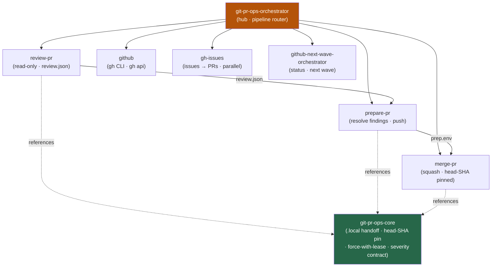

<div align="center">


</div>

<div align="center">

[](../../LICENSE)
[](../../skills.sh.json)
[](https://cli.github.com)
[](https://skills.sh/)

**The GitHub delivery cluster — a gated review → prepare → merge pipeline behind a single router.**
Reviewing, preparing, merging, or shipping work through PRs and issues? The orchestrator places your
task on the pipeline and routes; `git-pr-ops-core` holds the artifact handoff and safety rules they all share.

</div>


## What it is

8 skills: `git-pr-ops-orchestrator` (router) + `git-pr-ops-core` (shared model) + 6 specialists.
The cluster's job is to make GitHub PR/issue work *deterministic and safe* — the orchestrator knows
which spoke to reach for, and the core keeps the interlocking pipeline concepts (the `.local/`
artifact handoff, head-SHA pinning, force-with-lease push, head-pinned squash merge) consistent so no
spoke contradicts another.



## Skills by lane

| Lane | Spokes |
|---|---|
| **Router / model** | `git-pr-ops-orchestrator`, `git-pr-ops-core` |
| **PR pipeline** | `review-pr`, `prepare-pr`, `merge-pr` |
| **Direct query** | `github` |
| **Issues → PRs (autonomous)** | `gh-issues` |
| **Status & planning** | `github-next-wave-orchestrator` |

## The model that ties it together

Work moves through **three gated stages**, each producing an artifact the next consumes:

```
review-pr ──review.json──> prepare-pr ──prep.env──> merge-pr ──> MERGED
 (read-only)               (resolve + push)         (squash + pin)
```

Review is read-only; prepare resolves every BLOCKER/IMPORTANT finding and pushes **only** to the PR
head with `--force-with-lease`; merge is **head-SHA pinned**, required-check gated, and ends in
`MERGED` — never `--auto`, never a push to `main`. Full model in
[`git-pr-ops-core`](../../skills/git-pr-ops-core/SKILL.md).

## Install

```bash
npx skills add Sheshiyer/skill-clusters@git-pr-ops-orchestrator -g -y     # entry point
npx skills add Sheshiyer/skill-clusters@merge-pr -g -y                     # any spoke
```

## Local development

Part of the [`skill-clusters`](../../README.md) monorepo; the repo is the single source of truth.

```bash
./scripts/link-agents.sh --apply    # symlink ~/.agents/skills → these canonical copies
```
