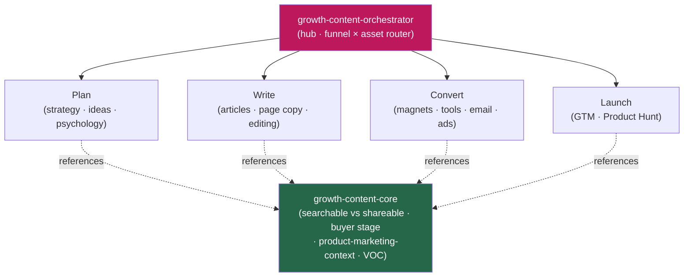

<div align="center">


</div>

<div align="center">

[](../../LICENSE)
[](../../skills.sh.json)
[](./README.md)
[](https://skills.sh/)

**Demand generation and content marketing — 13 specialists behind a single router.**
Planning, writing, converting, or launching marketing content? The orchestrator places your task
on the **funnel stage × asset type** map and routes; `growth-content-core` holds the
searchable-vs-shareable decision and the one positioning doc they all share.

</div>


## What it is

15 skills: `growth-content-orchestrator` (router) + `growth-content-core` (shared model) + 13
specialists. The cluster's job is to keep marketing output *navigable and on-strategy* — the
orchestrator knows which spoke to reach for, and the core keeps the interlocking decisions (every
asset is searchable/shareable/both, aimed at one buyer stage, written from one source-of-truth
positioning doc) consistent so the work never drifts into generic AI copy.



## Skills by stage

| Stage | Spokes |
|---|---|
| **Router / model** | `growth-content-orchestrator`, `growth-content-core` |
| **Foundation (shared)** | `product-marketing-context` |
| **Plan** | `content-strategy`, `marketing-ideas`, `marketing-psychology` |
| **Write** | `content-research-writer`, `copywriting`, `copy-editing` |
| **Convert** | `lead-magnets`, `free-tool-strategy`, `cold-email`, `email-sequence`, `ad-creative` |
| **Launch** | `launch-strategy` |

## The decision that ties it together

Every asset is **searchable, shareable, or both** — named before it's written, aimed at **one
buyer stage**, and drawn from one positioning doc:

```
SEARCHABLE (captures demand) ──┬── BOTH (rank + spread) ──┬── SHAREABLE (creates demand)
   keyword · intent · structure │                          │  insight · emotion · contrarian
                                └──── one buyer stage ──────┘
                          all sourced from .agents/product-marketing-context.md
```

Name the call before you write; serve one stage; pull voice and proof from the context doc — never
invent them. Full model in [`growth-content-core`](../../skills/growth-content-core/SKILL.md).

## Install

```bash
npx skills add Sheshiyer/skill-clusters@growth-content-orchestrator -g -y   # entry point
npx skills add Sheshiyer/skill-clusters@copywriting -g -y                   # any spoke
```

## Local development

Part of the [`skill-clusters`](../../README.md) monorepo; the repo is the single source of truth.

```bash
./scripts/link-agents.sh --apply    # symlink ~/.agents/skills → these canonical copies
```
