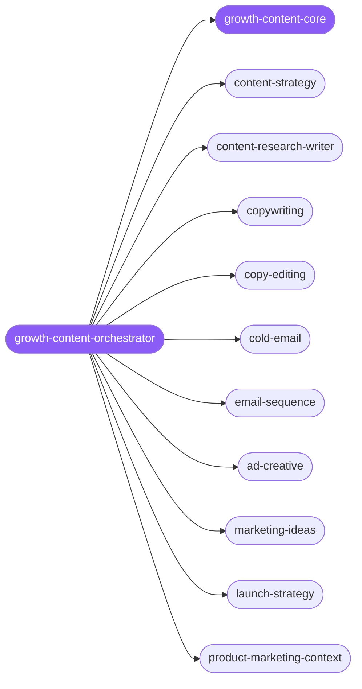

<div align="center">

</div>

<div align="center">

[](../../profiles.json)
[](#skills)
[](../../NOTICE)
[](https://skills.sh/)

</div>

> The single entry skill for growth and content-marketing work: it locates a task on the funnel-stage × asset-type map and delegates to one of 15 demand-generation specialists. The cross-cutting decision every asset shares — searchable vs. shareable, the buyer stage it targets, and the one product-marketing-context positioning doc all spokes read first — lives in `growth-content-core`.

## Hub-and-spoke



_…and 5 more in the table below._

## Skills

| Skill | Role | Loaded at startup |
|---|---|---|
| `growth-content-orchestrator` | 🧭 hub · router | ✅ enumerated |
| `growth-content-core` | 📐 hub · shared reference | ✅ enumerated |
| `content-strategy` | spoke | ⤵ on-demand |
| `content-research-writer` | spoke | ⤵ on-demand |
| `copywriting` | spoke | ⤵ on-demand |
| `copy-editing` | spoke | ⤵ on-demand |
| `cold-email` | spoke | ⤵ on-demand |
| `email-sequence` | spoke | ⤵ on-demand |
| `ad-creative` | spoke | ⤵ on-demand |
| `marketing-ideas` | spoke | ⤵ on-demand |
| `marketing-psychology` | spoke | ⤵ on-demand |
| `launch-strategy` | spoke | ⤵ on-demand |
| `lead-magnets` | spoke | ⤵ on-demand |
| `free-tool-strategy` | spoke | ⤵ on-demand |
| `product-marketing-context` | spoke | ⤵ on-demand |
| `avoid-ai-writing` | spoke | ⤵ on-demand |
| `zapier-make-patterns` | spoke | ⤵ on-demand |

## Tier & loading

Enumerated at CLI startup (orchestrator + core); spokes load on demand from `~/.agents/skill-clusters/skills/<name>/SKILL.md`.

## Install

```bash
npx skills add Sheshiyer/skill-clusters@growth-content-orchestrator -g -y
```

## Attribution

Authored for skill-clusters (MIT) — the 13 demand-generation specialists are originals. Two picked-up spokes (`avoid-ai-writing`, `zapier-make-patterns`) come from antigravity-awesome-skills (MIT), so the cluster is **authored + mixed**. See [NOTICE](../../NOTICE).

---
<sub>Part of <a href="../../README.md">skill-clusters</a> — the conductor closed-loop system · <a href="../../docs/CONDUCTOR-INTEGRATION.md">how it's wired</a></sub>
