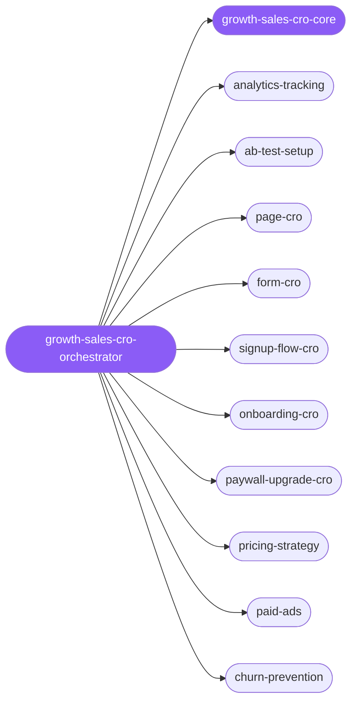

<div align="center">

</div>

<div align="center">

[](../../profiles.json)
[](#skills)
[](../../NOTICE)
[](https://skills.sh/)

</div>

> The single entry point for moving a number — conversions, activation, revenue, retention, or closed deals. It places a task on the **funnel stage × lever** map and routes to one of 24 specialists, with the shared funnel and the **baseline → hypothesis → test → decide** measurement loop kept in `growth-sales-cro-core`.

## Hub-and-spoke



_…and 14 more in the table below._

## Skills

| Skill | Role | Loaded at startup |
|---|---|---|
| `growth-sales-cro-orchestrator` | 🧭 hub · router | ✅ enumerated |
| `growth-sales-cro-core` | 📐 hub · shared reference | ✅ enumerated |
| `analytics-tracking` | spoke | ⤵ on-demand |
| `ab-test-setup` | spoke | ⤵ on-demand |
| `page-cro` | spoke | ⤵ on-demand |
| `form-cro` | spoke | ⤵ on-demand |
| `popup-cro` | spoke | ⤵ on-demand |
| `signup-flow-cro` | spoke | ⤵ on-demand |
| `onboarding-cro` | spoke | ⤵ on-demand |
| `paywall-upgrade-cro` | spoke | ⤵ on-demand |
| `pricing-strategy` | spoke | ⤵ on-demand |
| `paid-ads` | spoke | ⤵ on-demand |
| `churn-prevention` | spoke | ⤵ on-demand |
| `referral-program` | spoke | ⤵ on-demand |
| `revops` | spoke | ⤵ on-demand |
| `sales` | spoke | ⤵ on-demand |
| `sales-enablement` | spoke | ⤵ on-demand |
| `pitchdeck-skill` | spoke | ⤵ on-demand |
| `lead-research-assistant` | spoke | ⤵ on-demand |
| `customer-research` | spoke | ⤵ on-demand |
| `company-research` | spoke | ⤵ on-demand |
| `competitor-alternatives` | spoke | ⤵ on-demand |
| `competitor-teardown` | spoke | ⤵ on-demand |
| `app-store-optimization` | spoke | ⤵ on-demand |
| `app-store-screenshots` | spoke | ⤵ on-demand |
| `aso-appstore-screenshots` | spoke | ⤵ on-demand |

## Tier & loading

Off by default — 0 startup cost. Activate with `node scripts/tier.mjs --activate growth-sales-cro --apply`.

## Install

```bash
npx skills add Sheshiyer/skill-clusters@growth-sales-cro-orchestrator -g -y
```

## Attribution

Authored for skill-clusters (MIT). See [NOTICE](../../NOTICE).

---
<sub>Part of <a href="../../README.md">skill-clusters</a> — the conductor closed-loop system · <a href="../../docs/CONDUCTOR-INTEGRATION.md">how it's wired</a></sub>
