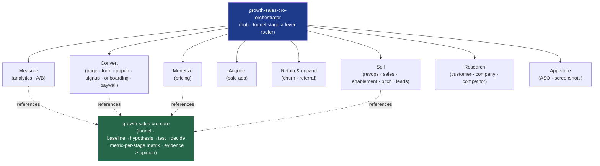

<div align="center">


</div>

<div align="center">

[](../../LICENSE)
[](../../skills.sh.json)
[](./README.md)
[](./README.md)
[](https://skills.sh/)

**Move the number — conversions, activation, revenue, retention, closed deals — 24 specialists behind a single router.**
Trying to lift conversions, grow revenue, or close more deals? The orchestrator places your task
on the **funnel stage × lever** map and routes; `growth-sales-cro-core` holds the funnel and the
**baseline → hypothesis → test → decide** loop they all share.

</div>


## What it is

26 skills: `growth-sales-cro-orchestrator` (router) + `growth-sales-cro-core` (shared model) +
24 existing specialists. The cluster's job is to keep growth work **honest and navigable** — the
orchestrator knows which of the 24 to reach for, and the core keeps the discipline consistent:
you optimize on **evidence, not opinion**, and no change is a "win" until a measured loop says so.



## Skills by funnel stage

| Stage / role | Spokes |
|---|---|
| **Router / model** | `growth-sales-cro-orchestrator`, `growth-sales-cro-core` |
| **Measure (substrate)** | `analytics-tracking`, `ab-test-setup` |
| **Convert** | `page-cro`, `form-cro`, `popup-cro`, `signup-flow-cro`, `onboarding-cro`, `paywall-upgrade-cro` |
| **Monetize** | `pricing-strategy` |
| **Acquire** | `paid-ads` |
| **Retain & expand** | `churn-prevention`, `referral-program` |
| **Sell (parallel path)** | `revops`, `sales`, `sales-enablement`, `pitchdeck-skill`, `lead-research-assistant` |
| **Research (evidence)** | `customer-research`, `company-research`, `competitor-alternatives`, `competitor-teardown` |
| **App-store growth** | `app-store-optimization`, `app-store-screenshots`, `aso-appstore-screenshots` |

## The model that ties it together

**Optimize on evidence, not opinion.** Every task lands on one funnel stage and one lever, and
no change earns the word *win* until it clears the loop:

```
BASELINE ─→ HYPOTHESIS ─→ TEST ─→ DECIDE   (one change · one metric · one hypothesis)
```

Instrument before you change; ground copy and offers in voice-of-customer evidence; respect
significance before declaring a winner; name the guardrail metric so a "win" in one stage isn't a
loss in another. Full model in
[`growth-sales-cro-core`](../../skills/growth-sales-cro-core/SKILL.md).

> **External companion bundle:** `alex-hormozi-pitch` and `customer-sales-automation` ship as a
> separate agent-only bundle (no top-level `SKILL.md`) and are archived outside this cluster —
> reach for them when you want Hormozi-style offer framing or the prebuilt sales/support agents;
> `sales`, `sales-enablement`, and `pitchdeck-skill` cover the same intents natively here.

## Install

```bash
npx skills add Sheshiyer/skill-clusters@growth-sales-cro-orchestrator -g -y     # entry point
npx skills add Sheshiyer/skill-clusters@page-cro -g -y                          # any spoke
```

## Local development

Part of the [`skill-clusters`](../../README.md) monorepo; the repo is the single source of truth.

```bash
./scripts/link-agents.sh --apply    # symlink ~/.agents/skills → these canonical copies
```
