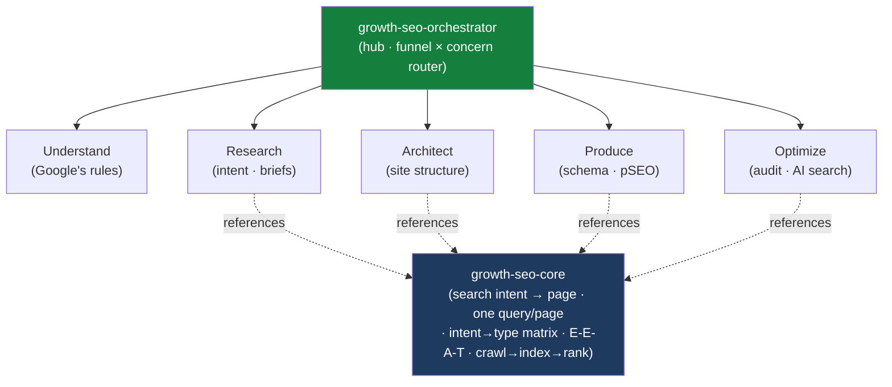

<div align="center">


</div>

<div align="center">

[](../../LICENSE)
[](../../skills.sh.json)
[](../../README.md)
[](https://skills.sh/)

**Rank, get found, and show up in AI answers — 8 SEO specialists behind a single router.**
Researching demand, planning content, fixing technical issues, or optimizing for AI search? The
orchestrator places your task on the **funnel stage × concern** map and routes; `growth-seo-core`
holds the search-intent model they all share.

</div>


## What it is

10 skills: `growth-seo-orchestrator` (router) + `growth-seo-core` (shared model) + 8 SEO
specialists. The cluster's job is to make a broad SEO toolkit *navigable* — the orchestrator
knows which of the 8 to reach for, and the core keeps the one decision everything turns on —
**search intent → page** — consistent across research, content, architecture, and audit.



## Skills by concern

| Concern | Spokes |
|---|---|
| **Router / model** | `growth-seo-orchestrator`, `growth-seo-core` |
| **Understand** | `google-official-seo-guide` |
| **Research (intent & briefs)** | `searchintentautomation`, `seo-content-brief` |
| **Architect** | `site-architecture` |
| **Produce & enrich** | `schema-markup`, `programmatic-seo` |
| **Optimize** | `seo-audit`, `ai-seo` |

## The decision that ties it together

Every SEO task reduces to one question:

```
Demand (a query) ──has──> Intent ──determines──> Content type ──filled by──> ONE page ──earns──> Visibility
```

Name the query and its intent **before** you write, build, or audit a page; one primary query per
URL (don't cannibalize); match content type to intent; earn rankings with genuine E-E-A-T. AI-search
visibility (AEO/GEO) is downstream of the same foundation, not a separate trick. Full model in
[`growth-seo-core`](../../skills/growth-seo-core/SKILL.md).

## Install

```bash
npx skills add Sheshiyer/skill-clusters@growth-seo-orchestrator -g -y     # entry point
npx skills add Sheshiyer/skill-clusters@seo-audit -g -y                   # any spoke
```

## Local development

Part of the [`skill-clusters`](../../README.md) monorepo; the repo is the single source of truth.

```bash
./scripts/link-agents.sh --apply    # symlink ~/.agents/skills → these canonical copies
```
