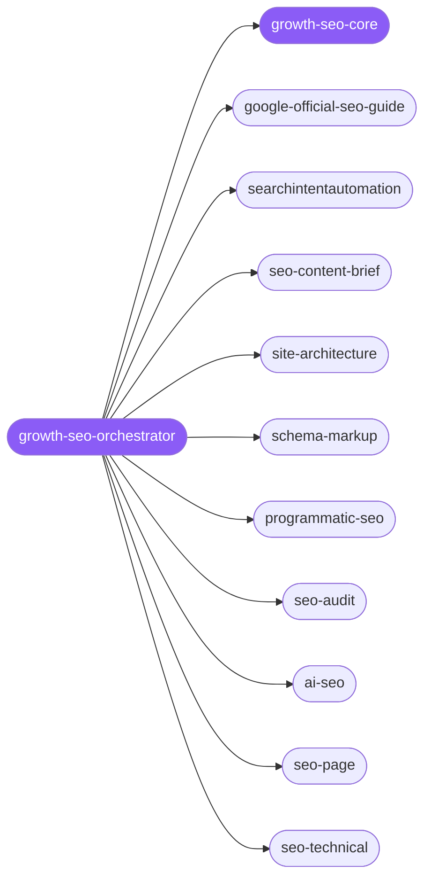

<div align="center">

</div>

<div align="center">

[](../../profiles.json)
[](#skills)
[](../../NOTICE)
[](https://skills.sh/)

</div>

> The single entry skill for SEO and search-growth work: it locates a task on the **funnel stage × concern** map and delegates to one of 8 search specialists — intent research, content briefs, site architecture, schema, programmatic pages, technical audits, AI-search (AEO/GEO), and Google's official guidance. The shared search-intent model, the one-query-per-page contract, and the E-E-A-T quality bar every task turns on live in `growth-seo-core`.

## Hub-and-spoke



_…and 7 more in the table below._

## Skills

| Skill | Role | Loaded at startup |
|---|---|---|
| `growth-seo-orchestrator` | 🧭 hub · router | ✅ enumerated |
| `growth-seo-core` | 📐 hub · shared reference | ✅ enumerated |
| `google-official-seo-guide` | spoke | ⤵ on-demand |
| `searchintentautomation` | spoke | ⤵ on-demand |
| `seo-content-brief` | spoke | ⤵ on-demand |
| `site-architecture` | spoke | ⤵ on-demand |
| `schema-markup` | spoke | ⤵ on-demand |
| `programmatic-seo` | spoke | ⤵ on-demand |
| `seo-audit` | spoke | ⤵ on-demand |
| `ai-seo` | spoke | ⤵ on-demand |
| `seo-page` | spoke | ⤵ on-demand |
| `seo-technical` | spoke | ⤵ on-demand |
| `seo-content` | spoke | ⤵ on-demand |
| `seo-images` | spoke | ⤵ on-demand |
| `seo-competitor-pages` | spoke | ⤵ on-demand |
| `seo-sitemap` | spoke | ⤵ on-demand |
| `seo-hreflang` | spoke | ⤵ on-demand |
| `seo-plan` | spoke | ⤵ on-demand |
| `seo-dataforseo` | spoke | ⤵ on-demand |

## Tier & loading

Enumerated at CLI startup (orchestrator + core); spokes load on demand from `~/.agents/skill-clusters/skills/<name>/SKILL.md`.

## Install

```bash
npx skills add Sheshiyer/skill-clusters@growth-seo-orchestrator -g -y
```

## Attribution

Primary source: **antigravity-awesome-skills** (MIT) — the granular execution spokes (`seo-page`, `seo-technical`, `seo-content`, `seo-images`, `seo-competitor-pages`, `seo-sitemap`, `seo-hreflang`, `seo-plan`, `seo-dataforseo`); see [NOTICE](../../NOTICE). + mixed: the 8 primary funnel spokes are authored for skill-clusters (MIT).

---
<sub>Part of <a href="../../README.md">skill-clusters</a> — the conductor closed-loop system · <a href="../../docs/CONDUCTOR-INTEGRATION.md">how it's wired</a></sub>
