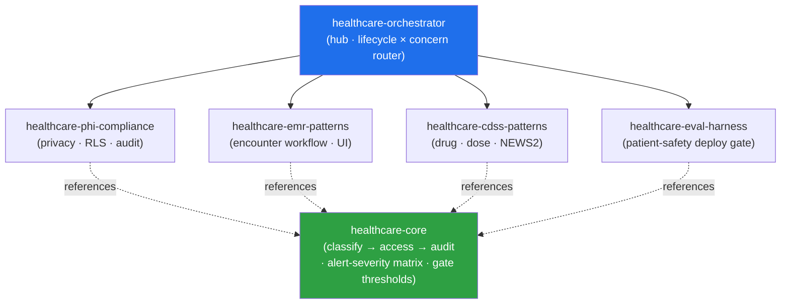

<div align="center">


</div>

<div align="center">

[](../../LICENSE)
[](../../skills.sh.json)
[](../../skills/healthcare-eval-harness/SKILL.md)
[](../../skills/healthcare-phi-compliance/SKILL.md)
[](https://skills.sh/)

**Four clinical specialists behind a single router.**
Building, reviewing, or shipping a healthcare app? The orchestrator places your task on the
**lifecycle × concern** map and routes; `healthcare-core` holds the data-protection contract and
the patient-safety rules they all share.

</div>


## What it is

6 skills: `healthcare-orchestrator` (router) + `healthcare-core` (shared model) + 4 clinical
specialists. The cluster's job is to make a patient-safety-critical domain *navigable* — the
orchestrator knows which specialist to reach for, and the core keeps the interlocking concepts
(classify → access-control → audit, the alert-severity matrix, the CRITICAL-vs-HIGH deploy gate)
consistent so no spoke contradicts another.



## Skills

| Concern | Spokes |
|---|---|
| **Router / model** | `healthcare-orchestrator`, `healthcare-core` |
| **Protect data (privacy)** | `healthcare-phi-compliance` |
| **Build the app (EMR/EHR)** | `healthcare-emr-patterns` |
| **Decision support (safety logic)** | `healthcare-cdss-patterns` |
| **Gate the deploy** | `healthcare-eval-harness` |

## The model that ties it together

Every healthcare app turns on one three-layer contract, protected **by default**:

```
Classify (what is sensitive) ──> Access-control (who may see it) ──> Audit (who did see it)
```

Grant the narrowest access that works; PHI never lands in logs, URLs, browser storage, or LLM
prompts; a critical clinical alert **blocks** the action (never a dismissable toast); and a single
CRITICAL eval failure blocks the deploy. Full model in
[`healthcare-core`](../../skills/healthcare-core/SKILL.md).

## Install

```bash
npx skills add Sheshiyer/skill-clusters@healthcare-orchestrator -g -y     # entry point
npx skills add Sheshiyer/skill-clusters@healthcare-phi-compliance -g -y   # any spoke
```

## Local development

Part of the [`skill-clusters`](../../README.md) monorepo; the repo is the single source of truth.

```bash
./scripts/link-agents.sh --apply    # symlink ~/.agents/skills → these canonical copies
```
