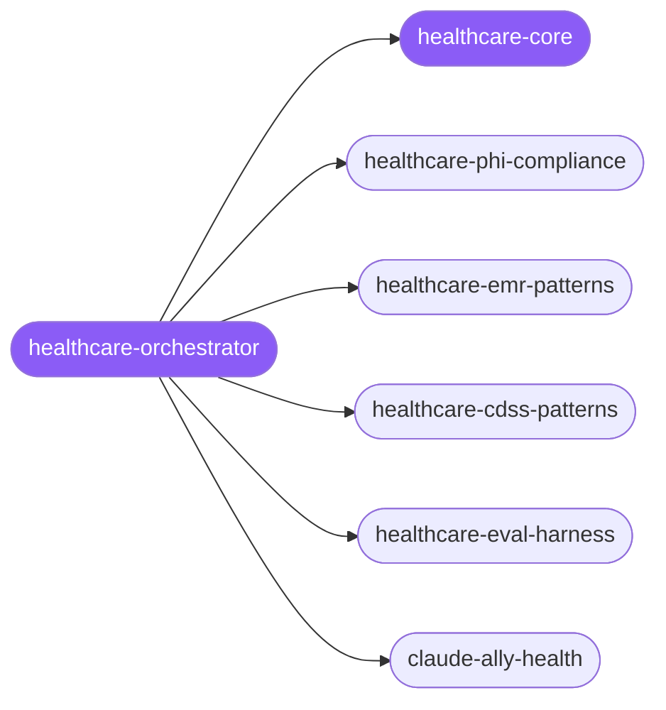

<div align="center">

</div>

<div align="center">

[](../../profiles.json)
[](#skills)
[](../../NOTICE)
[](https://skills.sh/)

</div>

> Routes a healthcare-software task to the right skill among clinical specialists — PHI/PII privacy & access control, EMR/EHR encounter workflows, the CDSS safety engine (drug interactions, dose, NEWS2), and the patient-safety eval harness that gates deploys. The cross-cutting model every clinical app shares — the three-layer data-protection contract (classify → control access → audit), the patient-safety bias (alerts block, never silently pass), and the CRITICAL-vs-HIGH gate thresholds — lives in `healthcare-core`.

## Hub-and-spoke



## Skills

| Skill | Role | Loaded at startup |
|---|---|---|
| `healthcare-orchestrator` | 🧭 hub · router | ✅ enumerated |
| `healthcare-core` | 📐 hub · shared reference | ✅ enumerated |
| `healthcare-phi-compliance` | spoke | ⤵ on-demand |
| `healthcare-emr-patterns` | spoke | ⤵ on-demand |
| `healthcare-cdss-patterns` | spoke | ⤵ on-demand |
| `healthcare-eval-harness` | spoke | ⤵ on-demand |
| `claude-ally-health` | spoke | ⤵ on-demand |

## Tier & loading

Off by default — 0 startup cost. Activate with `node scripts/tier.mjs --activate healthcare --apply`.

## Install

```bash
npx skills add Sheshiyer/skill-clusters@healthcare-orchestrator -g -y
```

## Attribution

Authored for skill-clusters (MIT) — the clinical spokes were contributed by Health1 Super Speciality Hospitals (Dr. Keyur Patel) + mixed: `claude-ally-health` is from antigravity-awesome-skills (MIT). See [NOTICE](../../NOTICE).

---
<sub>Part of <a href="../../README.md">skill-clusters</a> — the conductor closed-loop system · <a href="../../docs/CONDUCTOR-INTEGRATION.md">how it's wired</a></sub>
