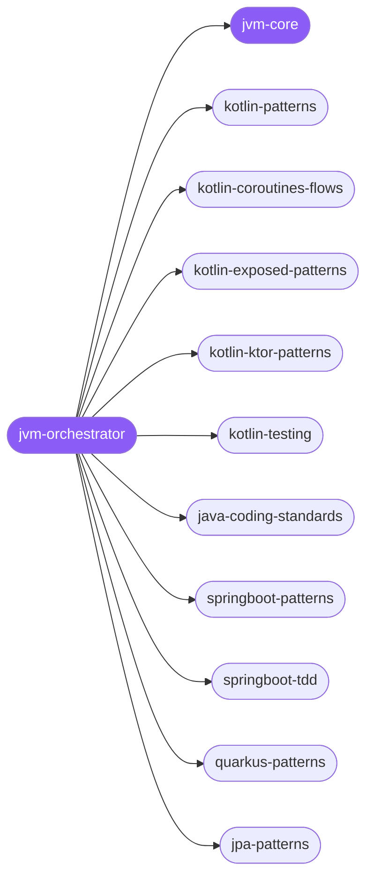

<div align="center">

</div>

<div align="center">

[](../../profiles.json)
[](#skills)
[](../../NOTICE)
[](https://skills.sh/)

</div>

> The single entry skill for Kotlin/Java work on the JVM: it locates a task on the **language × framework × concern** map and delegates to one of 16 specialist spokes — Kotlin (patterns, coroutines, Exposed, Ktor, testing), Java standards, the Spring Boot and Quarkus stacks (patterns → TDD → security → verification), JPA/Hibernate, and Compose Multiplatform. The cross-cutting stack/persistence/lifecycle model lives in `jvm-core`.

## Hub-and-spoke



_…and 7 more in the table below._

## Skills

| Skill | Role | Loaded at startup |
|---|---|---|
| `jvm-orchestrator` | 🧭 hub · router | ✅ enumerated |
| `jvm-core` | 📐 hub · shared reference | ✅ enumerated |
| `kotlin-patterns` | spoke | ⤵ on-demand |
| `kotlin-coroutines-flows` | spoke | ⤵ on-demand |
| `kotlin-exposed-patterns` | spoke | ⤵ on-demand |
| `kotlin-ktor-patterns` | spoke | ⤵ on-demand |
| `kotlin-testing` | spoke | ⤵ on-demand |
| `java-coding-standards` | spoke | ⤵ on-demand |
| `springboot-patterns` | spoke | ⤵ on-demand |
| `springboot-tdd` | spoke | ⤵ on-demand |
| `springboot-verification` | spoke | ⤵ on-demand |
| `springboot-security` | spoke | ⤵ on-demand |
| `quarkus-patterns` | spoke | ⤵ on-demand |
| `quarkus-tdd` | spoke | ⤵ on-demand |
| `quarkus-verification` | spoke | ⤵ on-demand |
| `quarkus-security` | spoke | ⤵ on-demand |
| `jpa-patterns` | spoke | ⤵ on-demand |
| `compose-multiplatform-patterns` | spoke | ⤵ on-demand |

## Tier & loading

Off by default — 0 startup cost. Activate with `node scripts/tier.mjs --activate jvm --apply`.

## Install

```bash
npx skills add Sheshiyer/skill-clusters@jvm-orchestrator -g -y
```

## Attribution

Authored for skill-clusters (MIT). See [NOTICE](../../NOTICE).

---
<sub>Part of <a href="../../README.md">skill-clusters</a> — the conductor closed-loop system · <a href="../../docs/CONDUCTOR-INTEGRATION.md">how it's wired</a></sub>
