<div align="center">


</div>

<div align="center">

[](../../LICENSE)
[](../../skills.sh.json)
[](https://kotlinlang.org)
[](https://spring.io/projects/spring-boot)
[](https://quarkus.io)
[](https://skills.sh/)

**16 Kotlin & Java specialists behind a single router.**
Building, testing, securing, or shipping a JVM service? The orchestrator places your task on
the **language × framework × concern** map and routes; `jvm-core` holds the stack-decision
model and the lifecycle they all share.

</div>


## What it is

18 skills: `jvm-orchestrator` (router) + `jvm-core` (shared model) + 16 specialists across
Kotlin, Java, Spring Boot, Quarkus, JPA, and Compose Multiplatform. The cluster's job is to
make a broad, multi-framework skill set *navigable* — the orchestrator knows which spoke to
reach for given your language and framework, and the core keeps the decisions (Kotlin vs Java,
Spring Boot vs Quarkus vs Ktor, JPA vs Exposed) and the patterns → TDD → security →
verification lifecycle consistent.

```mermaid
graph TD
    O["jvm-orchestrator<br/>(hub · language × framework × concern router)"]
    O --> K["Kotlin<br/>language & ecosystem"]
    O --> J["Java<br/>conventions"]
    O --> SB["Spring Boot<br/>stack"]
    O --> QK["Quarkus<br/>stack"]
    O --> DU["Persistence<br/>& UI"]

    K --> k1["kotlin-patterns"]
    K --> k2["kotlin-coroutines-flows"]
    K --> k3["kotlin-exposed-patterns"]
    K --> k4["kotlin-ktor-patterns"]
    K --> k5["kotlin-testing"]
    J --> j1["java-coding-standards"]
    SB --> s1["springboot-patterns"]
    SB --> s2["springboot-tdd"]
    SB --> s3["springboot-security"]
    SB --> s4["springboot-verification"]
    QK --> q1["quarkus-patterns"]
    QK --> q2["quarkus-tdd"]
    QK --> q3["quarkus-security"]
    QK --> q4["quarkus-verification"]
    DU --> d1["jpa-patterns"]
    DU --> d2["compose-multiplatform-patterns"]

    K -. references .-> C["jvm-core<br/>(language × framework decision<br/>· tooling matrix · patterns→TDD→security→verification)"]
    J -. references .-> C
    SB -. references .-> C
    QK -. references .-> C
    DU -. references .-> C

    style O fill:#b45309,color:#fff
    style C fill:#276749,color:#fff
```



## Skills by concern

| Concern | Spokes |
|---|---|
| **Router / model** | `jvm-orchestrator`, `jvm-core` |
| **Kotlin language & ecosystem** | `kotlin-patterns`, `kotlin-coroutines-flows`, `kotlin-exposed-patterns`, `kotlin-ktor-patterns`, `kotlin-testing` |
| **Java language** | `java-coding-standards` |
| **Spring Boot stack** | `springboot-patterns`, `springboot-tdd`, `springboot-security`, `springboot-verification` |
| **Quarkus stack** | `quarkus-patterns`, `quarkus-tdd`, `quarkus-security`, `quarkus-verification` |
| **Persistence & UI** | `jpa-patterns`, `compose-multiplatform-patterns` |

## The model that ties it together

Every JVM service starts with two choices that cascade into which spokes apply:

```
Language (Kotlin · Java) ──┐
                           ├──> Framework (Spring Boot · Quarkus · Ktor) ──> patterns → TDD → security → verification
Persistence (JPA · Exposed)┘
```

One language + one framework + one persistence layer **per service** — crossing streams is the
main failure mode. Full decision matrix and lifecycle in
[`jvm-core`](../../skills/jvm-core/SKILL.md).

## Install

```bash
npx skills add Sheshiyer/skill-clusters@jvm-orchestrator -g -y     # entry point
npx skills add Sheshiyer/skill-clusters@springboot-patterns -g -y  # any spoke
```

## Local development

Part of the [`skill-clusters`](../../README.md) monorepo; the repo is the single source of truth.

```bash
./scripts/link-agents.sh --apply    # symlink ~/.agents/skills → these canonical copies
```
