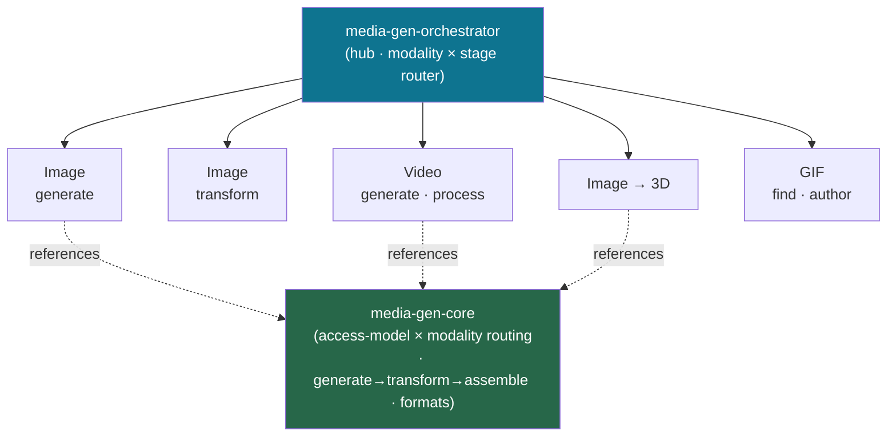

<div align="center">


</div>

<div align="center">

[](../../LICENSE)
[](../../skills.sh.json)
[](../../profiles.json)
[](https://skills.sh/)

**Generative + transformational media behind a single router.**
Generating, editing, upscaling, 3D-ifying, or assembling an image, video, or GIF? The orchestrator
places your task on the **modality × stage** map and routes; `media-gen-core` holds the
backend-routing decision they all share.

</div>


## What it is

13 skills: `media-gen-orchestrator` (router) + `media-gen-core` (shared model) + 11 specialists
spanning image generation, image enhancement, image-to-3D, AI video direction, FFmpeg processing,
frame extraction, and GIF search/authoring. The cluster's job is to make a grab-bag of media tools
*navigable* — the orchestrator knows which backend to reach for, and the core keeps the one
decision that matters (which generator, given its **access/billing model** and the **modality**)
consistent.



## Skills by concern

| Concern | Spokes |
|---|---|
| **Router / model** | `media-gen-orchestrator`, `media-gen-core` |
| **Image — generate** | `gpt-image-2`, `nano-banana-2`, `openai-image-gen`, `art` |
| **Image — transform** | `image-enhancer` |
| **3D** | `hunyuan3d` |
| **Video — generate** | `ai-video-director` |
| **Video — process / extract** | `ffmpeg`, `video-frames` |
| **GIF — find / author** | `gifgrep`, `slack-gif-creator` |

## The decision that ties it together

Every generative request resolves on two axes — **modality** × **access model**:

```
Request ──> [ image | 3D | video | GIF ] × [ subscription-CLI | API-key+billing | local/hosted-GPU | free ] ──> spoke
```

Confirm the chosen backend's prerequisite (plan / key / GPU endpoint) before spending a call;
generation is non-deterministic and may cost money. Full model in
[`media-gen-core`](../../skills/media-gen-core/SKILL.md).

## Install

```bash
npx skills add Sheshiyer/skill-clusters@media-gen-orchestrator -g -y     # entry point
npx skills add Sheshiyer/skill-clusters@hunyuan3d -g -y                  # any spoke
```

## Local development

Part of the [`skill-clusters`](../../README.md) monorepo; the repo is the single source of truth.

```bash
./scripts/link-agents.sh --apply    # symlink ~/.agents/skills → these canonical copies
```
